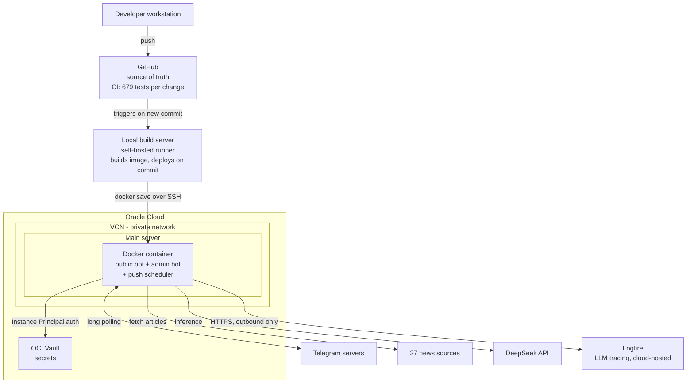
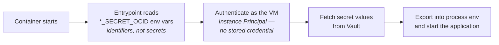
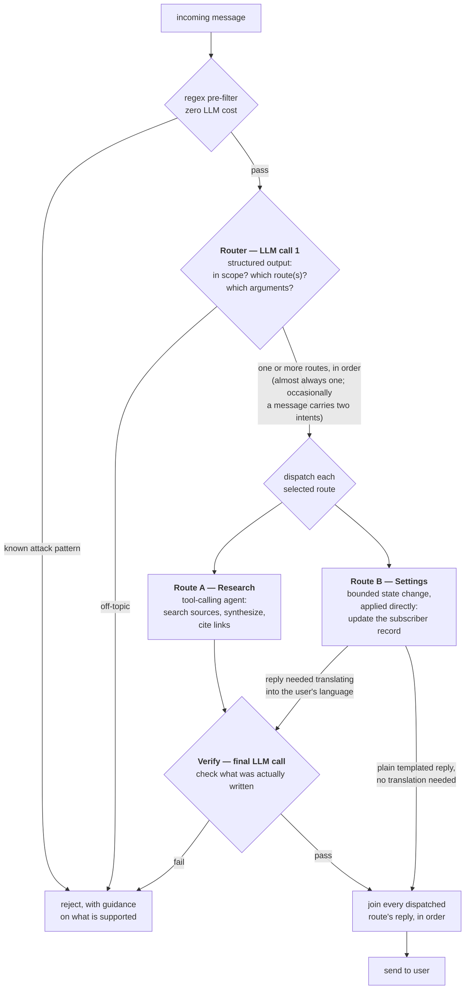
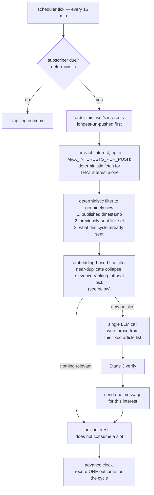
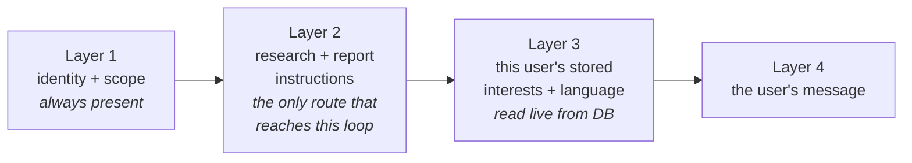
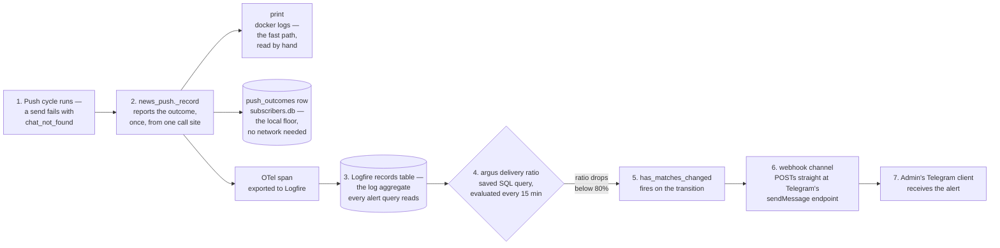
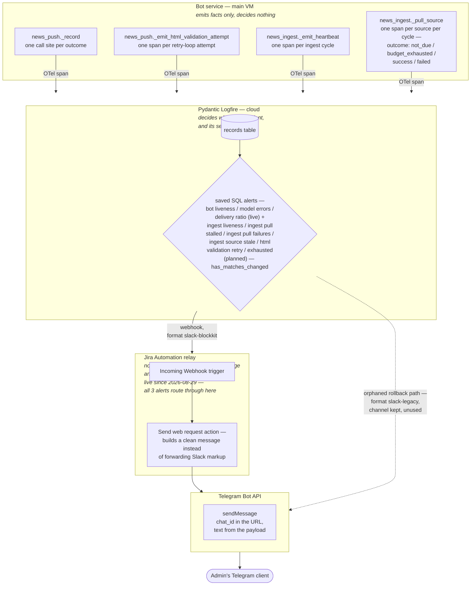

# Autonomous Technology-Trend Intelligence Agent
### Proactive, customized news search and delivery service

**An LLM agent that monitors 27 technology sources, works out what's
genuinely new, and delivers a personalized trend briefing on Telegram —
on a schedule, without being asked. Live in production on cloud
infrastructure.**

## What this document covers

An end-to-end walkthrough of the service: the architecture it runs on, how
the agent is designed, how quality is assured, and the difficulties hit
along the way with how each was solved. It covers the full lifecycle —
design, security, deployment, observability, testing, and live incident
response — with the reasoning and measurements behind each decision.

| Part | Contents |
|---|---|
| **A. Architecture** | Cloud topology, servers, secrets and identity, management access |
| **B. System design** | Components, agent workflow, prompt structure, message safety |
| **C. Quality assurance** | Test strategy, CI, post-deployment testing, monitoring, incident reporting |
| **Appendix A** | How AI was used to build this |
| **Appendix B** | Problems encountered and how each was solved; known limits; work deliberately declined |

---

## Why I built it

I follow several areas of technology closely, but keeping current meant
working through a dozen sites and forums on a regular basis — Hacker News,
arXiv, company engineering blogs, the tech press. Most of what I read was
either duplicated across all of them or irrelevant to what I actually
cared about. The reading wasn't the expensive part; the **filtering** was.

What I wanted was an assistant that would make that pass for me: read
across the major sources, work out what's genuinely new, summarize the
*trends* rather than the individual headlines, and deliver the result to
me rather than waiting for me to go ask.

### What it actually produces

<p align="center">
  
  
</p>

A scheduled briefing, grouped by the topics that subscriber asked for.
Each item is **synthesized across sources** — the first entry merges New
Scientist, Wired, and TechCrunch coverage into one paragraph rather than
listing three articles — and every claim carries its source links.

### What the motivation forced

Three decisions follow directly from that original need, and recur
throughout this document:

- **Personalization** — the service is multi-user: anyone approved can
  subscribe, and each subscriber customizes their own topics, reply
  language, and delivery schedule. "Relevant" is inherently per-user, so
  those preferences are stored per subscriber and steer every query
  (§B3)
- **Push, not pull** — the assistant comes to me. This is why the
  scheduled digest is the core feature rather than a nice-to-have, and why
  a messaging channel that couldn't support it was ultimately declined
  (Appendix B.3)
- **Synthesis, not aggregation** — merging coverage of the same story
  across sources is the point. A list of headlines is the problem I had,
  not the solution (§B2)

---

## Components chosen

These are the components chosen for this project, selected against its
actual scope, the maturity of the available APIs, and what the service
genuinely needed — not defaults carried over from another stack.

| Component | Role | Why this over the obvious alternative |
|---|---|---|
| **DeepSeek** | LLM inference | An order of magnitude cheaper than frontier models for a workload that's mostly summarization. Quality is sufficient for synthesis, and the cost difference is what makes an always-on push feature viable at all. Model choice is config-driven (`LLM_MODEL`/`LLM_MODEL_CLASSIFIER` environment variables), not hardcoded, so switching provider or model is a restart, not a code change — see `docs/plans/model-portability-plan.md` |
| **LangChain** | Agent framework | Framework-managed agent loop, and — critically — a swappable model interface. That's what lets the entire test suite run against a scripted fake with no network and no API cost. |
| **Telegram** | Delivery channel | Supports *long polling*, so the bot needs no public endpoint, no TLS, no domain. Eliminates an entire class of attack surface and operational burden. |
| **SQLite** | Persistence | Zero operational overhead and adequate at current scale. A known limitation, deliberately accepted — see Appendix B.2. |
| **Oracle Cloud** | Hosting | A genuinely perpetual free tier, not time-limited trial credits, including a managed secrets vault. |
| **Docker** | Packaging | One artifact that runs identically locally and on the VM; makes the deploy step a single image transfer. |
| **Pydantic Logfire** | LLM observability | Cloud-hosted, OpenTelemetry-native, zero infrastructure of its own. Replaced a self-hosted Arize Phoenix instance (2026-08-24) — Phoenix needed a dedicated second VM specifically because its memory could spike hard under load; Logfire needs no VM at all, which is a straightforward win once its usage tier covers this project's trace volume. |
| **model2vec** (`potion-base-8M`) | Article embeddings | A distilled, non-contextual embedding model chosen over fastembed/sentence-transformers specifically because the deploy target can't afford either's memory footprint (measured: 91 MB resident vs. 172 MB / 488 MB) — see `docs/analysis/cluster-measurements.md`. Powers near-duplicate collapse and relevance ranking in the push pipeline (§B2) — not offbeat/novelty selection, which is a separate, non-embedding mechanism (see NLTK below). |
| **NLTK** (POS tagging only) | Offbeat/novelty scoring | Powers `news_keyness.py`'s "how foreign is this word to this topic" statistic (§B2) — a from-scratch measured footprint of 84.6 MB peak RSS, small enough to run in-process on the bot VM alongside model2vec rather than needing its own machine, a design that was seriously considered and measured before being rejected (see `docs/current/infrastructure.md`). |

### Design principles

Five priorities drove nearly every decision that follows, in this order.

**P1 — Security ranks above features.** The bot is reachable by anyone who
finds it, which makes it both a prompt-injection surface and a cost-abuse
surface. Access control and guardrails were built *before* the service was
opened to other people, not retrofitted afterwards (§B4).

**P2 — LLM behavior must be traceable and diagnosable.** The model is
non-deterministic: there is no assertion for "the model follows this
instruction." It mostly will; occasionally it won't. When it doesn't, it
has to be possible to see exactly what the model was given and what it
produced — which is why every call is traced (§C4), and why any behavior
that *must* hold is enforced in code rather than by prompt (Appendix B.1).

**P3 — Abnormal situations must surface by themselves.** With one operator
and no on-call rotation, a failure nobody notices is indistinguishable
from no failure. The system raises an alert rather than waiting to be
asked (§C5).

**P4 — Accuracy is raised by post-deployment testing, not assumption.**
Unit tests running against a fake model cannot tell you whether a prompt
actually works. Verification against the real model after deployment is
what catches a problem before a user hits it (§C3).

**P5 — Minimal infrastructure budget.** Everything runs on a free tier;
the application VM is a `VM.Standard.E2.1.Micro` — **1 GB RAM, 1/8 OCPU**.
The least important of the five, but it shaped topology decisions
throughout (Appendix B.1).

---

# A. Architecture

## A1. Overall architecture

One VM in the live path, on a private virtual cloud network, plus a
managed secrets vault. (A second, identically-specced VM exists in the
same VCN — it ran Phoenix, this project's LLM tracing backend, until that
was retired in favor of a cloud-hosted alternative on 2026-08-24; see the
note under A2.) Deployment is currently a local build transferred to the
VM; the automated path is designed and covered below.



**CI/CD.** GitHub is the source of truth, and the full test suite runs on
every change (§C2). Deployment is handled by a **local build server**
acting as a self-hosted runner: on a new commit it builds the image and
ships it to production with `docker save | ssh … docker load`. Building
happens there rather than on the VM itself, because a build's resource
spike doesn't fit comfortably alongside the running service.

Using a self-hosted runner rather than a cloud runner is deliberate: the
deployment credential stays on a machine already trusted and never has to
live in a third-party secret store — the same principle as the vault
design in §A3. **The automated trigger is designed but not yet wired up;
deployment is currently run manually through the same path.**

## A2. Main server — and a second VM no longer in the live path

| | Main server |
|---|---|
| **Runs** | The bot container — both Telegram bots and the push scheduler |
| **Role** | The public-facing service, and the entire live system |
| **Exposure** | Public-facing in role, but **no inbound port is open today** — the bot pulls from Telegram rather than receiving callbacks. A channel requiring webhooks would change this |

**A second VM used to run this project's LLM tracing backend (Arize
Phoenix), kept separate from the bot deliberately** — a tracing backend
retaining 30 days of spans has a very different memory/disk profile from
the bot, and Phoenix's memory could spike hard enough under load that
co-locating them risked one taking the other down. That backend was
**retired 2026-08-24** in favor of Logfire, a cloud-hosted alternative
that needs no VM of its own at all — the bot calls out to it directly
over HTTPS (§A1), the same shape as every other external call it already
makes. The second VM wasn't deleted (its boot volume, including ~269 MB
of historical Phoenix trace data, is intact) but currently has no
purpose — a candidate use (a periodic job scoring article-vocabulary
"keyness" for offbeat push selection, §B2) was considered and rejected
once the real workload was measured (84.6 MB peak, comfortably inside
the *bot* VM's own headroom), in favor of running it there directly
instead. See `docs/current/infrastructure.md` for this VM's live status.

## A3. Identity and secrets

**The governing rule: no standing credential should have to leave a
machine that already holds a trusted identity.**

Credentials and tokens are kept **separate from the service** and stored
in **OCI Vault** rather than travelling with the code. Every secret — LLM
API key, both bot tokens, telemetry key — is fetched at container startup
using **Instance Principal** authentication: the VM proves its own
identity to the cloud provider, so there is no bootstrap credential to
leak in the first place.

Nothing is baked into the image, committed to source control, or passed as
a plaintext environment variable. What *is* passed to the container are
secret **OCIDs** — resource identifiers, useless to anyone without the
VM's own identity.



The same rule drives the deployment design in §A1 — which is why the build
server is self-hosted rather than a cloud runner that would need its own
copy of a deployment credential.

## A4. Management access

Both VMs are reachable only by SSH, with no dashboard or web UI exposed
to the public internet on either. Diagnosing the live system means
SSH-ing in directly (`docker logs`, `docker exec`, a real Python shell
against the live code) rather than a separate ops interface — there
isn't one. (When Phoenix was live, on the now-retired second VM, its own
dashboard added a second case of this same pattern: bound to the private
network, reachable only via an SSH-tunneled local port — same shape,
one more hop. Logfire's dashboard is the one exception, reachable
directly since it's Logfire's own cloud-hosted UI, outside this
project's infrastructure entirely.)

Two independent firewall layers apply throughout: cloud-level security
groups *and* host-level firewall rules must both permit a flow. Either one
misconfigured fails closed, not open.

---

# B. System Design

## B1. Component overview


| Component | Responsibility |
|---|---|
| **Bot layer** | Telegram-specific concerns only: receiving messages, output formatting, splitting replies over the 4096-character limit, retrying malformed markup as plain text |
| **Admin bot** | A *separate bot identity* carrying the approve/deny controls, so a stranger who finds the public bot has no path to them |
| **Guardrails** | Scope and safety checks on both input and output (§B4) |
| **Agent core** | The tool-calling loop; model is injected rather than constructed internally, which is what makes it testable (§C1) |
| **Source registry** | 27 pluggable fetchers. A source that errors or lacks an API key is skipped and the request still succeeds on the rest — one broken upstream never fails a user request |
| **User store** | Per-user interests, reply language, push interval, approval status |
| **Push scheduler** | Ticks every 15 minutes, sends to whoever is due (§B2) |
| **Telemetry** | Every LLM call and tool invocation captured as a structured span |

## B2. Agent design

### The request pipeline

**The first LLM call is a router.** Its job is to decide which route (or
routes — see below) the request takes, and extract whatever arguments
that route needs — not to answer it. Different routes then do genuinely
different work, because a request to change a setting has nothing in
common with a request to research a topic.



| Route | How it works | Why it's a separate route |
|---|---|---|
| **A — Research** | The tool-calling agent searches the source registry and reasons over what comes back | Its tool returns **content** — articles the model has to read, filter, and merge into a trend report. That interpretation step is what requires several model turns |
| **B — Settings** | The router's extracted arguments (which topic, which interval, which language) are applied directly against the subscriber record — no agent loop, no tool-calling reasoning | A **bounded state change**. The router has already established both the intent and its arguments, and the result needs no interpretation — it either succeeded or it didn't |

Route A hands the model raw material it must reason over across several
turns. Route B commits a change directly from what the router already
extracted, so there is nothing left to reason about — which is also why
Route A always reaches the verify step and Route B usually doesn't: a
plain templated confirmation isn't model output, so there's nothing to
check. It only rejoins the verify step when it had to be translated into
a subscriber's preferred reply language (a real, if less common, model
call on this path).

**A message can carry more than one intent** — "add robotics to my
interests and tell me what's new with it" is both a settings change and a
research request. The router returns an *ordered list* of routes for
that case (not just one), each is dispatched in turn against the same
original message, and their replies are joined into a single reply.
**All-or-nothing**: if any one segment fails the verify step, the whole
reply is rejected rather than sent partially — simpler to reason about
than a partially-successful message, at the cost of an all-or-nothing
retry on a rare failure.

### Why multiple LLM calls

A single call would be cheaper per message. Three exist because they do
genuinely different jobs, and collapsing them costs either safety or
quality:

| Call | Job | Why it can't be folded into the agent |
|---|---|---|
| **Router** | Is this in scope, which route(s) does it take, and what arguments does each need? | Runs *before* any expensive work, so off-topic input is rejected without paying for tool use and a long generation. Its decision also determines what each chosen route does — Route B never has to ask the model again for the topic/interval/language it already extracted. |
| **Route A agent** | Search, synthesize, cite | The only route whose tool returns content needing interpretation, so it's the only one that needs multiple model turns. Route B's state change doesn't. |
| **Verify** | Is what was actually written acceptable to send? | Some failures are only visible in the output. A model asked to check its own output in the same breath as producing it is grading its own work. Skipped on Route B when nothing was translated — a fixed template isn't model output, so there's nothing to verify. |

The router deliberately does **more than one job in one call** — safety
gate, route selection, and (for Route B) extracting the exact arguments
that route needs, all from the same read of the message. The obvious
implementation is a separate call per question; all of them need the same
understanding of the message, so merging them keeps the cost and latency
of the gate close to flat as more request types were added, rather than
growing with each one.

### The push workflow

The scheduled digest deliberately **does not** use the tool-calling agent
to decide what to fetch. This is the design decision I'd most want a
reviewer to look at.

The requirement is "never send the same article twice." An agent choosing
its own search calls will re-fetch the same top-N-by-recency results and
re-report them — you'd be *hoping* the model notices repetition, and per
P2, hope is not a mechanism.



**One message per interest, not one combined digest** (2026-08-24). The
interest string *is* the retrieval query, and merging several of them into
one candidate pool then asking one model call to cover all of it discards
the specificity that made each one findable — the same "any category layer
between the interest and the articles costs recall" result measured in
`docs/analysis/cluster-measurements.md` (100% against 11% on quantum
computing). `news_push.MAX_INTERESTS_PER_PUSH` bounds how noisy one cycle
can be, and staleness ordering stops that bound from permanently starving
whatever sorts last.

Note what did **not** change: a cycle still records exactly one row in
`push_outcomes`. The three live alert criteria are thresholds over that
table, so emitting one row per message would have silently rescaled all
three.

**The LLM is used only for what it's uniquely good at — writing readable
prose from a list it was handed.** Selection, deduplication, and
scheduling are ordinary deterministic code. Repeats become impossible by
construction rather than unlikely by persuasion.

Deduplication is belt-and-braces: primarily by publication timestamp (skip
anything published at or before that subscriber's last push), with a
remembered set of recently-sent URLs as a fallback for sources whose date
strings don't parse. Both are needed — real feeds are inconsistent about
dates.

### Fine-grained relevance filtering (added 2026-08-25)

A subscriber's interest first narrows the shared article cache by a
coarse **category** tag (28 broad taxonomy categories as of 2026-08-27,
assigned once per article at ingestion; the taxonomy is DB-driven and
grows over time — see `users_db.get_active_categories` — so treat this
count as a snapshot, not a constant).

That alone isn't enough: two subscribers with
related but distinct interests — "AI Agent" and "AI coding," say — both
map to the same "AI" category, so without a further step they'd receive
near-identical digests. This was a real, user-reported bug before the fix
below shipped.

An interest the classifier maps to **zero** categories is skipped
entirely for that push cycle — no candidates, no message, no slot
consumed — rather than treated as "matches any article." Reversed
2026-08-27 from the opposite (fail-open) behavior, after an interest
named "robotics" was genuinely misclassified into zero categories and
the old "unrestricted" handling let a completely unrelated article
reach that subscriber via the novelty-extra pick below. See
`docs/analysis/cluster-measurements.md`'s "2026-08-27 incident" section
for the full root-cause chain and the accepted tradeoff (an interest
that's genuinely too novel/niche for the current taxonomy now goes
quiet rather than receiving an imperfectly-filtered digest).

The fix is a second, embedding-based filter that runs on top of the
category match, using `model2vec` (`potion-base-8M`, chosen specifically
for its tiny memory footprint — see the components table above and
`docs/analysis/cluster-measurements.md` for the full backend comparison
against fastembed and sentence-transformers):

| Step | What it does |
|---|---|
| **Near-duplicate collapse** | Two articles above a cosine-similarity threshold (0.95) collapse to one — catches the same wire story syndicated under different URLs by different outlets, which a link-based check alone can't see |
| **Relevance ranking** | Each remaining candidate is scored against a retrieval query for the interest — not the bare interest string, but a short LLM-generated definition of it, cached per interest and measured to genuinely outperform the bare phrase at surfacing genuinely-relevant-but-differently-worded articles. Keeps an absolute, pool-size-scaled count (20–50 articles), not a fixed threshold — absolute similarity scores aren't comparable across different interests, only relative rank within one interest's own pool is |

Both steps degrade gracefully if the embedding model fails to load or a
specific article has no embedding (missing model files, out of memory,
an ingestion-time failure) — this is an enhancement to push quality, not
something any part of the pipeline depends on to function. A push cycle
with no working embedder behaves exactly as it did before this feature
existed for these two steps: pure recency ordering, no near-duplicate
collapse.

**Offbeat/novelty selection is keyword/keyness-driven, not a pure
embedding-similarity ranking** (as of 2026-08-26 — an earlier one-day
version was purely embedding-based and got replaced after live use
showed its picks read as unrelated more often than novel). It is
explicitly experimental and does not compete with the regular digest
for space: `MAX_ARTICLES_PER_TOPIC` regular candidates are always chosen
by pure recency, and the **novelty extra** is a single, additional
article appended to a candidate list that already has all of them — the
final message renders it as a short, distinctly separate closing note
("by the way, we noticed something interesting: ..."), never blended
into the main synthesized report. It's flagged by either of two
independent signals, computed by `news_keyness.py`:

- a small constant list of novelty-signaling keywords ("leak," "unveils,"
  "lawsuit," ...), checked directly against the article's text —
  unconditionally qualifies an article, no further threshold;
- **keyness** — a statistical measure (a signed log-likelihood ratio,
  the standard collocation-analysis fix for the small-count instability
  a simpler point-wise-mutual-information version of this was measured
  to have) of how much one of the article's own words is over- or
  under-represented in this interest's category, relative to that word's
  overall rate across the whole cache. A word present far less than its
  own overall rate predicts is genuinely foreign to the topic (a real
  measured example: an arXiv quantum-computing paper that happened to be
  tagged "AI"); a word present far MORE is topic-defining vocabulary,
  correctly never flagged (measured: "openai" scores strongly positive
  for the "AI" category). Only counts when the score clears
  `NOVELTY_KEYNESS_THRESHOLD` — a deliberately loose, unfitted first-cut
  bar, not "whichever candidate happens to score lowest": **if nothing in
  a topic's pool clears it, that push simply has no novelty section at
  all**, on purpose, not a gap to fill with a weak pick.

A keyword or keyness hit alone is not sufficient, though — added
2026-08-27 as the second half of the incident fix above: a candidate for
the novelty slot must also clear its own embedding-based relevance
floor, using the SAME relative/percentile mechanism as the regular
digest's relevance filter above but a deliberately wider clamp
(`NOVELTY_RELEVANCE_KEEP_FRACTION`/`_MIN`/`_MAX`, roughly double the
regular one) run as a second pass over the raw category-matched pool.
This closes the gap Fix 1 alone didn't: even for a topic with real
mapped categories, the coarse category match doesn't guarantee genuine
relevance, and a keyword hit like "unveiled" has no topic awareness at
all on its own. Wider than the regular cut on purpose — novelty content
is allowed to be "not so important, but eye-opening," so it only needs
to prove "still related to topic," not "would have made the regular
digest."

Computed once per `news_ingest.py` cycle over the whole cache (the
expensive step, POS-tagging, is shared across every active category) and
persisted, so reading it at push time is a cheap local database lookup,
never a live NLTK call in the push path — the same precompute-once-at-
ingestion shape as the embedding steps above, just independent of them
and of the embedder entirely. Getting this design right took five
real-data iterations, four of which failed for four different, specific,
measured reasons; see `docs/analysis/cluster-measurements.md`'s "Offbeat
selection, take two" for the full trail, including a considered (and
rejected, once actually measured) design running this on a second VM.

## B3. The four-layer prompt

The agent's system prompt is **composed fresh on every call** rather than
being a fixed string:



| Layer | Purpose |
|---|---|
| **1 — Identity and scope** | Who the agent is and what it will not do. Constant across every request; the anchor the guardrails back up. |
| **2 — Task instructions** | Research and trend-report-formatting instructions. Route B (settings changes) no longer reaches this loop at all — it's dispatched directly against the database (§B2) — so as of the settings-dispatch refactor, this layer no longer branches by category; it's unconditionally the research instructions. |
| **3 — User memory** | This subscriber's interests and reply language, read live from the database. **This layer is the entire personalization mechanism.** |
| **4 — The message** | The actual request. |

Two properties worth noting. First, **there is no per-user code path** —
one implementation serves everyone, and the difference between two users
is entirely what Layer 3 composes in. Second, **the layers don't
accumulate**: they're rebuilt per call, so the system prompt's size is
constant no matter how long a conversation runs. Only conversation history
grows, and that's capped separately at 1 hour / 20 messages.

## B4. Preventing dangerous messages

Four layers, deliberately ordered cheapest-first so obvious attacks are
rejected before they cost anything:

| Layer | Mechanism | Cost | Catches |
|---|---|---|---|
| **1. Pre-filter** | Regex patterns | Free | Known injection phrasings, attempts to elicit the system prompt |
| **2. Scope gate** | Stage 1 classifier | One cheap call | Off-topic or manipulative requests that don't match a known pattern |
| **3. Prompt hardening** | Layer 1 instructions | Free | Steers the model away from unsafe framings in the first place |
| **4. Output check** | Stage 3 classifier | One cheap call | Self-disclosure or drift that's only visible in what was actually written |

Layer 4 is deliberately **narrower for constrained request types**: for
"add an interest," layers 1–3 already pin down what a valid reply looks
like, so it only checks for self-disclosure. Open-ended news queries,
where the model has real latitude, get the full check.

Rejections aren't silent — the user gets an explanation of what the
service does handle, so a false positive is recoverable rather than a dead
end.

**Access control** backs all of this: the bot is not open. Every new user
lands in a pending state and an admin approves or denies from the separate
admin bot, which bounds cost-abuse exposure to a known set of people.

---

# C. Quality Assurance

## C1. Test cases

**679 tests, ~40 seconds, $0 API cost per run.**

That's possible because the model is dependency-injected: production
passes a real client, tests pass a scripted fake. No conditional
test-mode logic, no network, no flakiness from a live model — cheap enough
to run on every change rather than before a release.

| Area | What's covered |
|---|---|
| Agent core | Tool dispatch, prompt composition, settings dispatch (Route B — deterministic, so directly assertable with no fake model needed), user-memory injection |
| Guardrails | Each layer independently: pre-filter patterns, router classification and argument extraction (including multi-category routing), output checks, fail-open behavior on both an error and a `None` result |
| User store | Interests, language, push settings, approval state transitions, schema migration |
| Push scheduler | Due-checking, both deduplication paths, per-subscriber failure isolation |
| Bot layer | Message chunking against the 4096-char limit, formatting normalization, malformed-markup fallback |
| Sources | Each fetcher against captured real-world payloads; graceful degradation when one fails |

**Deliberate gaps, and how they're covered instead.** Unit tests against a
fake model structurally cannot verify anything about *real* model
behavior — whether a prompt actually elicits the right format, whether a
classifier is accurate. That's not a gap to be closed with more unit
tests; it needs a different instrument, which is what C3 and the
measurement discipline in Appendix B.1 exist for.

## C2. Test before commit — CI

The full suite runs on every change. Because it's fast and free, there's
no incentive to skip it, which is the main thing that keeps a test suite
alive in a solo project.

Beyond the suite, CI is the right place for structural checks that catch
whole classes of mistake — for example, asserting the *exact* set of
registered bot commands rather than merely that some handler exists. That
specific check exists because of the incident in Appendix B.1, where a test that
verified a category of thing passed happily while the specific thing was
broken.

## C3. Post-deployment testing

Unit tests can't cover the real model, so a **17-case checklist runs
against the live service after every deployment** (11 of the 17 scripted
end to end by `tools/run_smoke_tests.py`; the rest — command handlers
that don't route through its test endpoint — checked manually against
real Telegram), with defined inputs and expected outputs:

| # | Covers |
|---|---|
| 1–3 | Core news query; formatting renders correctly; non-English input handled |
| 4–6 | Interest add/remove; already-covered topic recognized; command form works |
| 7–8 | Push enable/disable; interval change takes effect |
| 9–11 | Language set including script variants; applies to subsequent replies |
| 12–13 | Guardrail rejection is informative; new-user onboarding from a genuinely fresh account |
| 14 | Multi-category routing: one message combining a settings change and a news query gets both addressed in one reply |
| 15–16 | `/help` and an unrecognised command both get a real reply, not silence |
| 17 | Multi-topic `set_interest`: naming several distinct topics in one message stores all of them, not a garbled or collapsed single entry |

Each case was derived from a real regression class, so the checklist grows
as the system teaches me what breaks. A deploy isn't done until it passes.

## C4. Monitoring

**Tracing is the primary instrument, not logs.** Every LLM call and tool
invocation is captured as a structured span with its exact prompt and
response, queryable after the fact. For a non-deterministic system this
matters more than log lines: when a user reports "it answered oddly," the
useful question is *what exactly did the model see and produce* — which a
log statement generally doesn't capture but a trace does.

Logs remain the fast path for operational questions — did the scheduler
tick, was this subscriber due, did the send succeed. Each push cycle
records its outcome per subscriber (sent / nothing new / blocked /
errored), so timing questions are answerable directly rather than by
inference.

**Each outcome is reported three ways, from one call site, so they
cannot disagree.** A `print` (the fast path above), a database row
(`push_outcomes` — the floor: it needs no network, so it still answers
"what happened" if telemetry export itself is broken), and an
OpenTelemetry span. The span is the one of the three an alarm can
actually see — Logfire's alert engine queries spans, not a row sitting
on the VM's own disk — so an outcome recorded in the database but never
emitted as a span would be invisible to every alert in §C5, permanently.
The subscriber identifier on the span is an opaque, stable id
(`users_db.external_id`), never the real Telegram chat id — hygiene
rather than a privacy control at this project's current scale, but free
to do now and expensive to retrofit once a backlog of spans already
carries the raw one.

**A worked example, tracing one real failure through every stage from a
log line to an admin's phone:**



Steps 1–2 are the same for every outcome, always. Steps 3 onward only
happen for the span — which is why an outcome that's logged and stored
but never reaches Logfire is invisible past step 2, permanently, no
matter how correct the print line or the database row are.

Under Phoenix, trace retention was explicitly bounded at 30 days —
self-hosted on the VM's own disk, so unbounded growth was a real,
if slow-motion, outage risk. Logfire (§A1) is cloud-hosted, so that
specific risk doesn't apply to this project's own infrastructure
anymore; retention is whatever Logfire's plan/tier provides, not
something configured here.

## C5. Incident reporting and alerting

Per principle P3, a failure nobody notices is indistinguishable from no
failure — so the system reports its own problems rather than waiting to be
asked.

**All alerts converge on the same admin Telegram bot** already built for
access approvals (§B4), through one path — Logfire's own alert engine,
via a Jira Automation relay (below) — not a delivery mechanism this
project stood up itself: the channel already existed for a different
reason and alerting simply reuses it. This used to be two independent
paths, the second a direct send from the bot process itself whenever the
HTML-validation retry loop hit its third failure; that path was removed
the same day it shipped, once it became clear "the service decides this
is an incident and sends Telegram itself" was the exact anti-pattern this
section argues against (see "The service never decides what's an
incident" below) — every outcome now reaches the admin the same way, via
a span Logfire evaluates, not via a second bespoke code path.

### Three live alerts, evaluated by Logfire, delivered with no receiver of this project's own



Solid arrows are the live path today. The one dotted arrow is a
deliberate rollback path, not a second live route: the direct-to-Telegram
channel every alert used before 2026-08-29 is still configured in
Logfire but no alert points at it any more — repointing the three
alerts back to it (see `local-infra/infrastructure.yaml`'s `logfire.
channel_id`) is the fallback if the Jira relay ever proves unreliable.
See `docs/plans/observability-platform-plan.md`'s 2026-08-29 section for
the full discovery process (why `raw-data` doesn't work, why
`slack-blockkit` does) and what's still open (the six "planned" alerts
in the diagram above don't exist yet -- four ingest-specific, listed
below, plus the two html-validation ones described in "The service never
decides" further down).

Each is a saved SQL query over Logfire's `records` table (the same store
the spans in §C4 land in), evaluated on a fixed cadence, with the query's
own time window written *inside* the SQL rather than left to the
engine's separate `time_window` field — redundant on purpose, in the
direction that fails safe. If the engine's own windowing ever turns out
to mean something other than assumed, the query still works; omitting
the inner window fails the other way, silently, by matching every row
ever received and never once observing "zero."

| Alert | Fires on | Window / cadence |
|---|---|---|
| `argus bot liveness` | no span reaches Logfire at all — a dead man's switch | 30 min / evaluated every 5 min |
| `argus model errors` | any push cycle records a `model_error` outcome | 30 min / 5 min |
| `argus delivery ratio` | delivered fewer than 80% of what was generated | 24 h / 15 min |

**Planned, not yet created** — replace what `healthcheck.py` used to check
in-process (retired 2026-08-29, see "The service never decides" below)
with the finer-grained signal `_pull_source`'s span now provides:

| Alert (planned) | Fires on |
|---|---|
| `argus ingest liveness` | no `ingest_heartbeat` span in 30 min — dead man's switch, ingest-specific |
| `argus ingest pull stalled` | no `ingest_source_pull` span with `pull.outcome=success` anywhere, in 1h — the whole pipeline isn't succeeding, not just one source |
| `argus ingest pull failures` | more than 5 `ingest_source_pull` spans with `pull.outcome=failed` in 30 min |
| `argus ingest source stale` | per source: last successful `ingest_source_pull` is older than a multiple of that source's own `pull.expected_interval_hours` — deliberately per-source and interval-aware, since 24 of 27 sources pull every 4h by default (not hourly), so a flat threshold would misfire on nearly all of them nearly all the time |

All three live alerts use Logfire's `has_matches_changed` notification
mode, which fires on a *transition* in either direction rather than on
every evaluation that matches — onset and recovery are each exactly one
message, so a condition that's been true for hours doesn't repeat itself
into noise, and "it's fixed now" is reported just as reliably as "it
broke." The four planned ingest alerts above are designed to use the
same mode once created.

**Delivery needs no public endpoint of this project's own** — worth
stating plainly, because the obvious design (host a receiver on the bot
VM) is both expensive and circular. An endpoint on the bot VM would die
with the bot VM, which is exactly the failure `argus bot liveness`
exists to catch — so the one alarm most likely to fire during a real
outage would lose its own delivery path at the moment it mattered.
Logfire's webhook channel POSTs at a Jira Automation "Incoming webhook"
trigger instead — Atlassian's public endpoint, not this project's VM, so
the same "can't die with the bot VM" property still holds. Jira's own
"Send web request" action then builds the actual Telegram message and
POSTs it to Telegram's `sendMessage` endpoint. This is a deliberate
upgrade over the channel's original design (straight Logfire →
Telegram, no receiver at all, kept configured as the rollback path
above): that design's one real cost was that Logfire's webhook body is
Slack markup, and Telegram renders it completely literally (`<url|text>`,
`:emoji:` codes, code fences all show up as raw characters) — readable
but permanently unpolished. Routing through Jira first means the
message Telegram actually receives is built cleanly (see
`local-infra/infrastructure.yaml`'s `jira_alert_relay.action` for the
exact template) instead of forwarded verbatim — at the cost of one more
external hop between an incident firing and it reaching a human, which
is why the rollback path is kept rather than deleted.
**The *dedicated, alert-only* bot token property still holds through this
new hop** — confirmed 2026-08-29: the Jira rule's "Send web request"
action authenticates with the same dedicated alert-only bot the old
direct channel used, not the admin or subscriber bot's, so a Logfire *or*
Jira compromise can still only ever send fake alerts, never act with
either bot's real capability.

### What `argus delivery ratio` is actually protecting against

Generation is where the money goes; delivery is where the value is. A
push cycle can succeed at every step that's easy to watch — the
scheduler ticks, the model call returns, no exception is thrown — while
the one thing that was supposed to happen (a subscriber receiving
something) silently never does. `argus delivery ratio` is a *ratio*
rather than a raw count specifically so it doesn't drift as the
subscriber base grows: it was wrong immediately, not only once volume
made it obvious. See Appendix B.1 for the real incident that forced
this design and the two independent defects that had to be fixed
together to close it, and `news_push.UNREACHABLE_STRIKES` for the
code-level circuit breaker (three consecutive undeliverable cycles turns
push off for that one subscriber) that now bounds how much any single
broken chat can cost even before an alert fires.

### The service never decides what's an incident — not even for its own retries

A subscriber-visible formatting failure (malformed Telegram HTML the
model produced) is caught by a non-LLM validator and retried with the
specific failure fed back into the prompt, up to three times, before
being sent anyway so a subscriber never gets *nothing*
(`telegram_html.validate` + the retry loop in `news_push.run_push_cycle`).
The first version of this, shipped and then reworked the same day,
had the retry loop decide for itself that "3 failed attempts is an
incident" and send a Telegram message directly — precisely the
service-makes-the-call anti-pattern the rest of this section argues
against. **It doesn't do that anymore.** Every attempt — pass or fail,
first or last — emits the same-shaped span
(`html_validation_attempt`, with `attempt`/`valid`/`reason` attributes)
and nothing else; the service has no opinion on whether one failed
attempt is noise or three in a row is worth telling anyone about. That
judgment, like the three live alerts above, belongs entirely to a
Logfire query — planned but not yet created, so today these spans are
recorded and queryable by hand, not yet paging anyone. Once built, they
route through the same Jira relay as any other alert (§C5's
architecture diagram above), not a second, bespoke delivery path — the
whole point of drawing the line at "service emits facts" is that a new
kind of incident never needs new delivery code, only a new query.

**`healthcheck.py` was the last holdout of the same anti-pattern, and is
gone as of 2026-08-29.** It polled two synthetic DB timestamps
(`__ingest_tick__`/`__push_tick__`) once an hour from inside the bot
process and sent an admin Telegram message directly on a change — the
service deciding "this is an incident" and paging, exactly like the old
HTML-validation retry loop above. It also had a real limitation the
retry loop's old version didn't: zero per-source granularity, so a
single ingest source silently broken for days (every other source still
succeeding) was invisible to it — diagnosing a live alert from it turned
into manual `docker exec` process inspection rather than a query,
because the print-only per-source outcomes it depended on weren't
queryable at all. Replaced by `news_ingest._pull_source`'s
`ingest_source_pull` span (one per source per cycle, `pull.outcome` ∈
`not_due`/`budget_exhausted`/`success`/`failed`, see the architecture
diagram above) plus the four planned ingest alerts in the table above —
deliberately shipped with a real gap before those alerts exist (no
transition safety net this time, unlike the HTML-validation rework),
since the old mechanism's own diagnosis this session is what proved it
wasn't good enough to keep around.

**The handling loop** is: *user-visible symptom or alert → gather evidence
before theorizing → root cause → fix → close the hole that let it
through.* That last step is the one that compounds — every incident
resolves into either a new test case or a new post-deploy check, so the
same class of failure can't recur silently. The 17-case checklist in §C3
is built entirely from past incidents.

**Possible extension, not built:** the same alert path could carry an
automated remediation step — triggering a fix workflow, or opening a pull
request against the detected fault — since the alert already knows what
failed and the deployment path is scripted. It's deliberately left out for
now on budget and cost grounds; alerting a human who can decide is
sufficient at this scale, and automated remediation adds a class of risk
(acting on a false positive) that isn't worth taking on for a pilot.

A worked example of the loop follows in Appendix B.1.

---

# Appendix A — How AI Was Used to Build This

I built this working with an AI coding assistant throughout. That was a
deliberate choice, and I'd argue it's one of the things the project
demonstrates rather than a caveat on it.

| I owned | The AI assistant owned |
|---|---|
| **Problem definition** — the scope, the feature set, and what the output should look like | — |
| **Architecture decisions** — the cloud topology, the service infrastructure (Docker, tracing backend), the CI/CD workflow, and how incidents get detected and reach me | Turning those designs into working code |
| **System design** — the layered-prompt structure (§B3) and merging the safety gate with the intent router into one call (§B2), both specified before implementation | Implementation of the specified designs |
| **Scope and priorities** — security before deployment; decline the second channel (Appendix B.3); accept SQLite's limits rather than migrate prematurely | Research passes I directed — pricing tiers, registrar comparison, library capabilities — which I then decided on |
| **Test strategy** — directing what needed coverage, reviewing the test plan for gaps, and settling when each kind of test runs (CI vs. post-deployment). Manual verification was the smaller part; steering the plan was the larger one | Writing the test cases to that plan; diagnostic execution — querying traces, running the N-trial measurements in Appendix B.1 |
| **Verification standards** — insisting a fix be measured before shipping (Appendix B.1) and that invariants be enforced in code rather than by prompt | Implementation, documentation drafting |
| **Final judgment** — every decision recorded here is one I made and can defend | — |

**The short version: I was the engineer and the operator; the assistant
was leverage.** It wrote most of the lines. It did not decide what the
system should be, what was acceptable to ship, or when something was
actually fixed.

Working this way well means *not* trusting generated output by default —
which is exactly where the two hardest-won lessons in Appendix B.1 come from:
enforce invariants in code rather than asking nicely, and measure whether
a fix actually worked instead of assuming the plausible one did. Both are
the direct product of verifying rather than accepting.


---

# Appendix B — Difficulties and How They Were Solved

## B.1 Problems hit in development and production

### Model instruction compliance is not a guarantee

**Problem.** Telegram renders HTML, not Markdown. The prompt says so
explicitly. The model complied — most of the time. When it didn't, users
saw literal `**asterisks**`. Prompt tuning improved it and did not
eliminate it. The same pattern appeared again with the model occasionally
narrating its process ("Let me compile these into a report…") before the
actual report.

**Solution.** Enforce it in code, not just in the prompt:

```python
_MARKDOWN_BOLD_RE = re.compile(r"\*\*(.+?)\*\*")

def _normalize_markdown_bold(text: str) -> str:
    """No-op when the model behaves. A fix when it doesn't."""
    return _MARKDOWN_BOLD_RE.sub(r"<b>\1</b>", text)
```

**The generalized principle**, which recurs throughout the system: a
prompt instruction is an *optimization* — it makes the good outcome
likely. For any invariant that must hold on user-visible output, there
must also be code-level enforcement. Keep both: the prompt makes the
backstop rarely fire; the backstop makes the guarantee real.

### A plausible fix that made things measurably worse

**Problem.** The Stage 3 output check was doing two jobs — detecting
self-disclosure and judging topical appropriateness — and had a
false-positive problem, occasionally rejecting perfectly good replies.

**The obvious fix** was to split the harder check into its own smaller,
focused prompt. A narrower question should be more reliable.

**Measured, it was dramatically worse.** Because P2 rules out unit-testing
model behavior, the substitute is N-trial measurement: send the *same*
input to the real model 15 times and count how often the answer is
correct.

The check is measured on two **opposite** tests, and both have to pass:

| Test | Input | Correct behavior |
|---|---|---|
| **A — False positive** | A *valid* reply, e.g. "that topic is already covered" | **Let it through** |
| **B — Self-disclosure** | A reply that leaks the bot's own configuration | **Block it** |

Four versions were tried, each differing in **how the check was
structured** rather than in what it was asked to detect:

| # | Prompt structure | Test A — lets valid replies through | Test B — catches leaks | Outcome |
|---|---|---|---|---|
| 1 | **Stepped prompt** — ordered checks, single yes/no answer | 1/3 | 2/3 *(3-trial spot-check)* | Broke in production |
| 2 | **Stepped prompt, reworded** — same steps, ambiguity fixed | 13/15 | 15/15 | **Shipped** — better, still lossy |
| 3 | **Compact prompt, no steps** — one free-form question | not measured | **1/15** | **Rejected before shipping** |
| 4 | **Structured output, one field per condition** — no steps; code decides precedence | **15/15** | **15/15** | **Shipped** — current |

Sample sizes differ: the 3-trial figure was a spot-check run while
diagnosing a different bug, not a deliberate benchmark, so it carries much
less weight than the 15-trial numbers. It was enough to establish that the
original was not solid either.

Version 3 is not a step in the progression — it's a **discarded
experiment**, kept in the record because discarding it is the point. Note
what it means against version 1: at **1/15 versus 2/3**, the
"simplification" was *worse at catching leaks than the version it was
meant to improve* — a regression below the starting point, on the axis
that matters most. It was the plausible idea: a narrower, more focused
prompt *should* be more reliable.

**What worked was changing the output *format*, not the wording.** In
versions 1–3 the model had to answer the question, decide how competing
conditions ranked, and compress the result into a single yes/no token.
Version 4 splits that into two independent boolean fields —
`discusses_own_configuration` and `appropriate_bot_content` — so the model
answers two simple factual questions and **the code decides what to do
with the answers.** The model is asked to do strictly less, and does it
more reliably. That is the same principle as the previous section, applied
to the guardrail itself: move the logic that must be correct out of the
prompt and into code.

> **Caveat on causation.** These labels describe *what changed*, not a
> proven mechanism. Version 4 altered three things at once — it removed
> the steps, changed the output format, and moved precedence into code —
> so the measurements can't attribute the improvement to any one of them.
> Version 3's failure is likewise ambiguous: it dropped the steps, but its
> prompt was also mostly negative space (a short "flag this" followed by a
> long "this does NOT include…" carve-out, with no contrasting example of
> an acceptable reply), and the exclusion may simply have dominated.
> Isolating the cause would need a further experiment — a stepped prompt
> with text output against the same content as structured fields. That
> hasn't been run. What the numbers *do* support is the operational
> conclusion: the change was measured before shipping, and the plausible
> option was rejected on evidence.

Two takeaways. Structured output is markedly more reliable than asking a
model for a parseable text answer. And **the "obvious" prompt improvement
has to be measured** — shipping that plausible-sounding simplification on
reasoning alone would have left a safety control roughly 93% broken, and
nothing would have errored to reveal it.

### Fitting the service into 1 GB

**Problem.** The design calls for two separate Telegram bot identities —
a public one and an admin one — which is a security property worth
keeping (§B1). But running them as two OS processes means loading
LangChain and the Telegram library into memory **twice**, and the VM has
1 GB total.

**Solution.** Run both bots and the scheduler in **one process and one
asyncio event loop**, while keeping them as two distinct bot identities.
Measured at the time: **~135 MB combined, versus close to double that
split.** The security boundary is preserved; the memory cost isn't paid
twice.

Steady-state usage was 137–172 MB then; it's ~185 MB as of 2026-08-25,
after the embedding-based relevance filter (§B2) added a resident
model2vec model to the process. Re-measured directly on the live
container rather than assumed forward from the older figure — the
directional comparison above (combined vs. split) still holds, the
absolute baseline just moved with a real added feature.

The tradeoff is honest: separate processes would give better fault
isolation, and on a larger instance that would be the better call. The
code is structured so either topology works — each bot retains a
standalone entry point.

### A silent failure that broke onboarding for everyone

Worth walking through in full, because the failure produced **no error
signal anywhere** — the hardest kind to find.

**Symptom.** I invited someone to the bot. They messaged it. They never
appeared in the approval queue and never got a reply.

**Evidence gathered, before forming a theory:**

| Check | Result | What it ruled out |
|---|---|---|
| Query the live user store | No pending row at all | The approval flow never started — registration was never called |
| Full container logs | Completely clean, zero errors | Not a crash, not a swallowed exception |
| Both bot identities via the platform API | Both alive, correct | Not a token or configuration problem |

Three checks eliminated the likely causes and left something
uncomfortable: the message appeared not to have been *processed at all*.

**The clue** came from asking them for a screenshot. Their first message
was `/start` — which is what the Telegram client sends automatically when
someone taps START on a bot they've never used.

**Root cause.** The bot registered command handlers for `/interests` and
`/language`, and a plain-text handler that explicitly excluded *all*
commands. There was no `/start` handler. So `/start` matched nothing at
all: no reply, no database write, no exception. It fell into a gap in the
routing table.

**Impact was wider than one user.** `/start` is the literal first thing
Telegram prompts a new user to send — onboarding was broken for *every*
new user, invisibly, because a message matching nothing produces no error.

**Fix, and the part that matters.** Adding the handler was trivial. The
useful question was why nothing caught it. The existing test asserted:

```python
assert any(isinstance(h, MessageHandler) for h in handlers)
```

That passed the entire time the bug existed — a handler *was* registered,
just not one that could ever match `/start`. The test verified that
routing existed, not that it was *correct*. So the fix included tightening
it to assert the exact command set, plus a new post-deploy case exercising
a genuinely new account.

**Transferable lesson:** a test that asserts a *category* of thing exists
will pass happily while the specific thing is broken. And silent failures
deserve over-investigation — a bug that produces no error signal will not
surface on its own, however long it runs.

### The observability tool was itself broken

**Problem.** Investigating a question about push timing, I checked the
container logs and found them **completely empty** — not just missing the
scheduler lines, but missing the startup banner too, for the container's
entire uptime. Logging that had been added specifically for diagnosis had
never actually worked.

**Root cause.** Python block-buffers stdout when it isn't attached to a
terminal, which is the normal case for a detached container. Log lines
accumulated in a buffer that never filled and so never flushed.

**Solution.** Force unbuffered output at the image level, and add
"confirm logs are actually producing output" as an explicit post-deploy
step. **A logging fix isn't verified until you've confirmed the log lines
arrive** — a lesson that generalizes to any instrument you rely on but
haven't checked recently.

### A leak that produced no error worth noticing, and the metric that would have caught it on day one

The incident behind `argus delivery ratio` (§C5) — worth walking through
because every "obvious" alarm would have stayed silent through the whole
thing, which is exactly why the criterion that actually caught it looks
the way it does.

**Symptom.** The DeepSeek balance ran out after 8 days. Nothing had
crashed; nothing looked wrong from inside the running service.

**Why the obvious alarms would all have missed it:**

| What an alarm might watch | Why it stayed quiet |
|---|---|
| Error rate | Every fetch, generation, and guardrail check *succeeded*. This was extra work, not failed work |
| Liveness | The scheduler ticked correctly, on schedule, for all 8 days |
| A spend spike | Arrived as a slow ramp — one or two abandoned test accounts per deploy — so a threshold set anywhere reasonable only fired near the very end |
| The delivery error itself | Every leaked account *did* produce `chat_not_found` on send — but that error had been routine background noise since smoke testing began, so it read as expected, not as a signal |

**Root cause, two independent defects, either alone would have left the
leak open.** First: a send failure was handled *before* the point where
`last_push_at` (the timestamp that gates when a subscriber is next due)
advanced — so a chat that could never receive anything regenerated a
**full digest on every 15-minute scheduler tick, forever**, not once per
its nominal push interval. Three LLM calls per cycle × 96 ticks/day × 19
affected accounts is on the order of 5,000 calls a day — the actual scale
that empties a balance in 8 days, and roughly 24x worse than the
original back-of-envelope estimate, which had assumed the nominal
interval governed the retry rate. Second: nothing ever turned push off
for a subscriber who was *structurally* unable to receive anything, no
matter how many cycles in a row failed the same way.

**Fix, two parts, both required.** (A) Any failure *after* generation
now advances `last_push_at` regardless of what happened next — once a
digest has been paid for, the next attempt is a full interval away,
whatever went wrong with delivery. A failure *before* generation
deliberately does not advance it — a transient provider blip shouldn't
cost a subscriber their whole cycle, so the fix is asymmetric on
purpose. (B) Three consecutive undeliverable cycles now turn push off
for that one subscriber (`news_push.UNREACHABLE_STRIKES`) — chosen as
three rather than one because disabling a real subscriber who's merely
having a bad cycle is the more expensive mistake, and only
`push_enabled` is cleared, so a user who blocks the bot and later
unblocks it resumes without losing their interests or language
preference.

**Why `argus delivery ratio` specifically is the metric that generalizes
from this.** It's a symptom (what a subscriber actually experiences),
not a cause (which specific error fired) — the same distinction Google
SRE practice draws, and the reason it's weighted as the most important
of the three live criteria in §C5. During the incident it read as 3
delivered out of 22 generated, every single cycle, from the first leaked
account onward — wrong from day one, not just eventually. A cause-based
alarm has to be re-derived for every new way delivery can fail; a
symptom-based one catches all of them, including ones nobody has thought
of yet.

## B.2 Known limitations

What the system *cannot* currently do. Most are accepted tradeoffs rather
than oversights, and each has an explicit trigger for when it stops being
acceptable.

| Limitation | Impact | Current mitigation | Fix when |
|---|---|---|---|
| **Single point of failure** | VM loss = service down and subscriber data lost | Container auto-restarts; data is reconstructible | Before real users — backup is cheap, scheduled not done |
| **Probabilistic guardrails** | A legitimate message can occasionally be rejected; a bad one can occasionally pass | Four independent layers; classifiers fail *open*, so an outage never blocks legitimate use | Inherent — reduced by measurement (Appendix B.1), not eliminated |
| **In-memory conversation history** | Restart loses in-flight context | Deliberate — history is capped at 1 h / 20 messages anyway | Only if conversations become genuinely multi-turn |
| **No rate limiting** | An approved user could burn API quota | Access is approval-gated, bounding exposure | Before opening access more widely |
| **SQLite can't scale or be shared** | Hard ceiling on horizontal scaling | Fine at current scale; single-process topology means no second host needs access. All access sits behind one module, keeping migration cheap — see `docs/plans/data-layer-plan.md` | When a second host or real concurrency is needed |
| **Linear cost scaling** | Each push subscriber costs LLM calls per interval | Cheap model; conservative 1-hour interval floor | Before any open signup |
| **Manual deploy step** | Human error surface each release | Documented workflow plus the 17-case checklist | CD is designed (§A1), not built |
| **Silent source degradation** | An upstream format change makes that source quietly return nothing | Per-source isolation keeps the request succeeding on the rest | Needs a source-health check; not built |

## B.3 Work deliberately declined

Judgment shows as much in what's declined as in what ships.

**A second messaging channel (LINE).** Fully designed, then shelved after
research. LINE's API is webhook-only, which would have forced a public
HTTPS endpoint, TLS certificate management, a domain, and signature
verification — dismantling the "no inbound port" property in §A1. That
cost might have been justified, except the free tier caps **push messages
at 200/month account-wide** (replies are unlimited). The push digest is
the feature that makes the product worth having, and 200/month across all
users doesn't support it. Decision: hold until there's a business model
that justifies the paid tier. The research is written up rather than
discarded.

**A managed database.** Deferred with the reasoning recorded in
`docs/plans/data-layer-plan.md`. SQLite on one VM doesn't scale and can't be
shared — a real limitation, and an understood one. But migrating now,
with no paying users, means paying migration cost twice: once today, once
again when the actual requirements are known.

**Rate limiting, database backups, dependency scanning.** All identified
in a written security review, all documented, none built. They're scoped
as "before real users," not "before a pilot works."
