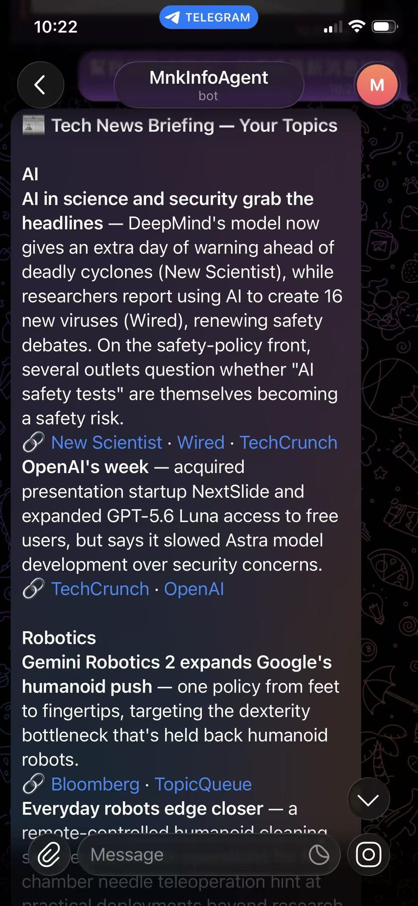
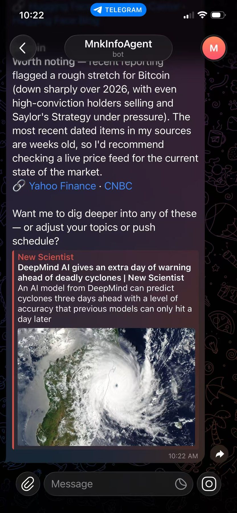
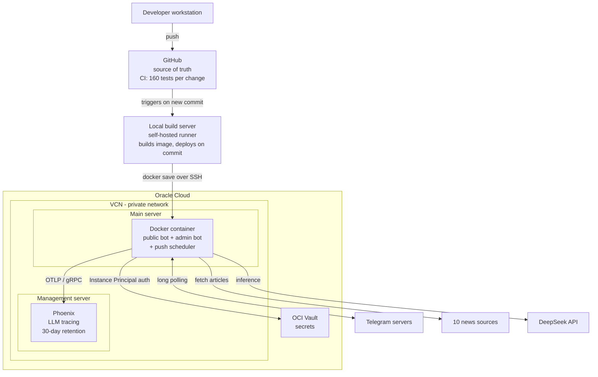
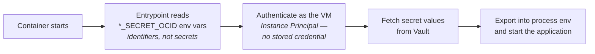
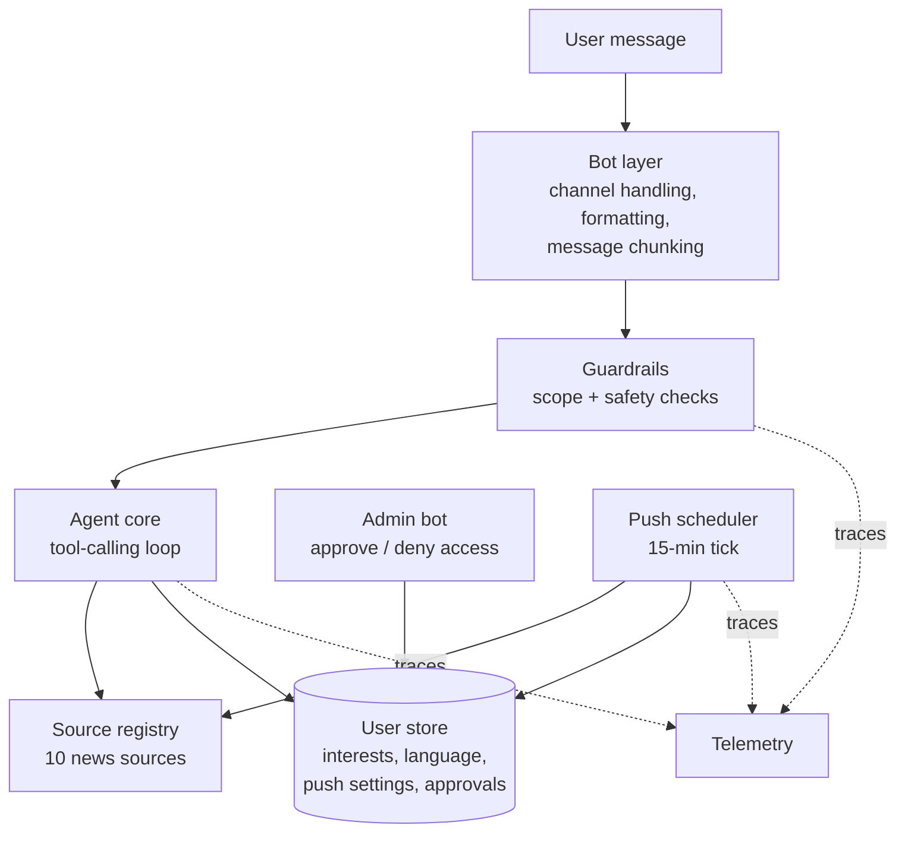
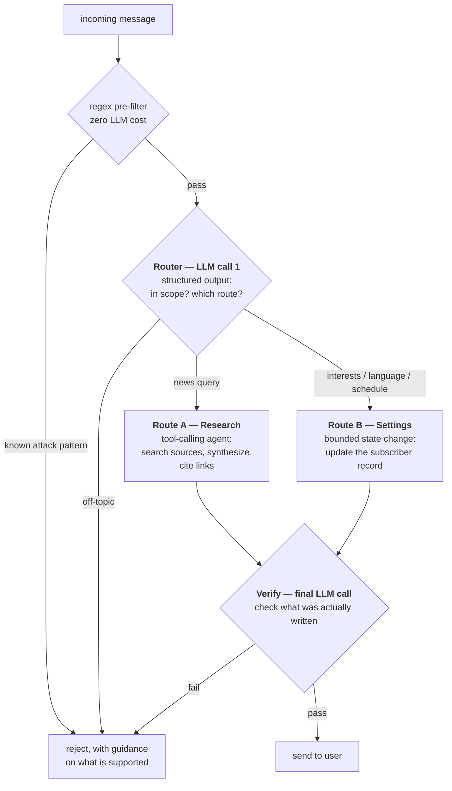
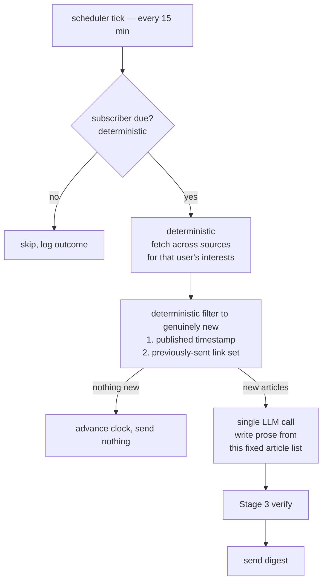
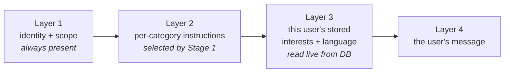

# Autonomous Technology-Trend Intelligence Agent
### Proactive, customized news search and delivery service

**An LLM agent that monitors 10 technology sources, works out what's
genuinely new, and delivers a personalized trend briefing on Telegram —
on a schedule, without being asked. Live in production on cloud
infrastructure.**

## What this document covers

An end-to-end walkthrough of the service: the architecture it runs on, how
the agent is designed, how quality is assured, and the difficulties hit
along the way with how each was solved. It covers the full lifecycle —
design, security, deployment, observability, testing, and live incident
response — with the reasoning and measurements behind each decision.

| Part | Contents |
|---|---|
| **A. Architecture** | Cloud topology, servers, secrets and identity, management access |
| **B. System design** | Components, agent workflow, prompt structure, message safety |
| **C. Quality assurance** | Test strategy, CI, post-deployment testing, monitoring, incident reporting |
| **D. Difficulties** | Problems encountered and how each was solved; known limits; work deliberately declined |
| **Appendix** | How AI was used to build this |

---

## Why I built it

I follow several areas of technology closely, but keeping current meant
working through a dozen sites and forums on a regular basis — Hacker News,
arXiv, company engineering blogs, the tech press. Most of what I read was
either duplicated across all of them or irrelevant to what I actually
cared about. The reading wasn't the expensive part; the **filtering** was.

What I wanted was an assistant that would make that pass for me: read
across the major sources, work out what's genuinely new, summarize the
*trends* rather than the individual headlines, and deliver the result to
me rather than waiting for me to go ask.

### What it actually produces

<p align="center">
  
  
</p>

A scheduled briefing, grouped by the topics that subscriber asked for.
Each item is **synthesized across sources** — the first entry merges New
Scientist, Wired, and TechCrunch coverage into one paragraph rather than
listing three articles — and every claim carries its source links.

### What the motivation forced

Three decisions follow directly from that original need, and recur
throughout this document:

- **Personalization** — the service is multi-user: anyone approved can
  subscribe, and each subscriber customizes their own topics, reply
  language, and delivery schedule. "Relevant" is inherently per-user, so
  those preferences are stored per subscriber and steer every query
  (§B3)
- **Push, not pull** — the assistant comes to me. This is why the
  scheduled digest is the core feature rather than a nice-to-have, and why
  a messaging channel that couldn't support it was ultimately declined
  (§D3)
- **Synthesis, not aggregation** — merging coverage of the same story
  across sources is the point. A list of headlines is the problem I had,
  not the solution (§B2)

---

## Components chosen

These are the components chosen for this project, selected against its
actual scope, the maturity of the available APIs, and what the service
genuinely needed — not defaults carried over from another stack.

| Component | Role | Why this over the obvious alternative |
|---|---|---|
| **DeepSeek** | LLM inference | An order of magnitude cheaper than frontier models for a workload that's mostly summarization. Quality is sufficient for synthesis, and the cost difference is what makes an always-on push feature viable at all. Model choice is injected rather than hardcoded into consumers, so it stays swappable — see `docs/model-portability-plan.md` |
| **LangChain** | Agent framework | Framework-managed agent loop, and — critically — a swappable model interface. That's what lets the entire test suite run against a scripted fake with no network and no API cost. |
| **Telegram** | Delivery channel | Supports *long polling*, so the bot needs no public endpoint, no TLS, no domain. Eliminates an entire class of attack surface and operational burden. |
| **SQLite** | Persistence | Zero operational overhead and adequate at current scale. A known limitation, deliberately accepted — see §D2. |
| **Oracle Cloud** | Hosting | A genuinely perpetual free tier, not time-limited trial credits, including a managed secrets vault. |
| **Docker** | Packaging | One artifact that runs identically locally and on the VM; makes the deploy step a single image transfer. |
| **Arize Phoenix** | LLM observability | Self-hostable and OpenTelemetry-native — full trace fidelity with no per-trace SaaS billing, which matters when tracing every call. |

### Design principles

Five priorities drove nearly every decision that follows, in this order.

**P1 — Security ranks above features.** The bot is reachable by anyone who
finds it, which makes it both a prompt-injection surface and a cost-abuse
surface. Access control and guardrails were built *before* the service was
opened to other people, not retrofitted afterwards (§B4).

**P2 — LLM behavior must be traceable and diagnosable.** The model is
non-deterministic: there is no assertion for "the model follows this
instruction." It mostly will; occasionally it won't. When it doesn't, it
has to be possible to see exactly what the model was given and what it
produced — which is why every call is traced (§C4), and why any behavior
that *must* hold is enforced in code rather than by prompt (§D1).

**P3 — Abnormal situations must surface by themselves.** With one operator
and no on-call rotation, a failure nobody notices is indistinguishable
from no failure. The system raises an alert rather than waiting to be
asked (§C5).

**P4 — Accuracy is raised by post-deployment testing, not assumption.**
Unit tests running against a fake model cannot tell you whether a prompt
actually works. Verification against the real model after deployment is
what catches a problem before a user hits it (§C3).

**P5 — Minimal infrastructure budget.** Everything runs on a free tier;
the application VM is a `VM.Standard.E2.1.Micro` — **1 GB RAM, 1/8 OCPU**.
The least important of the five, but it shaped topology decisions
throughout (§D1).

---

# A. Architecture

## A1. Overall architecture

Two VMs on a private virtual cloud network, plus a managed secrets vault.
Deployment is currently a local build transferred to the VM; the automated
path is designed and covered below.



**CI/CD.** GitHub is the source of truth, and the full test suite runs on
every change (§C2). Deployment is handled by a **local build server**
acting as a self-hosted runner: on a new commit it builds the image and
ships it to production with `docker save | ssh … docker load`. Building
happens there rather than on the VM itself, because a build's resource
spike doesn't fit comfortably alongside the running service.

Using a self-hosted runner rather than a cloud runner is deliberate: the
deployment credential stays on a machine already trusted and never has to
live in a third-party secret store — the same principle as the vault
design in §A3. **The automated trigger is designed but not yet wired up;
deployment is currently run manually through the same path.**

## A2. Main server and management server

| | Main server | Management server |
|---|---|---|
| **Runs** | The bot container — both Telegram bots and the push scheduler | Phoenix, the LLM tracing backend |
| **Role** | The public-facing service | Internal tooling, for the operator only |
| **Exposure** | Public-facing in role, but **no inbound port is open today** — the bot pulls from Telegram rather than receiving callbacks. A channel requiring webhooks would change this | No public exposure at all; private network plus SSH only |
| **Why separate** | **Scalability** — the public service is the part that would need to scale out (e.g. behind Kubernetes), and it can only do that if it isn't tied to a co-located stateful tool. **Isolation** — one going down must not take the other with it: the service keeps running if tracing is unavailable, and tracing survives to diagnose a service failure | A tracing backend retaining 30 days of spans has a very different memory and disk profile from the bot; co-locating them would put the observability tool in competition with the very thing it observes |

## A3. Identity and secrets

**The governing rule: no standing credential should have to leave a
machine that already holds a trusted identity.**

Credentials and tokens are kept **separate from the service** and stored
in **OCI Vault** rather than travelling with the code. Every secret — LLM
API key, both bot tokens, telemetry key — is fetched at container startup
using **Instance Principal** authentication: the VM proves its own
identity to the cloud provider, so there is no bootstrap credential to
leak in the first place.

Nothing is baked into the image, committed to source control, or passed as
a plaintext environment variable. What *is* passed to the container are
secret **OCIDs** — resource identifiers, useless to anyone without the
VM's own identity.



The same rule drives the deployment design in §A1 — which is why the build
server is self-hosted rather than a cloud runner that would need its own
copy of a deployment credential.

## A4. Management access

The Phoenix dashboard is bound to the private network and is **not exposed
to the public internet**. Reaching it means opening an SSH tunnel to the
management server and browsing to the forwarded local port — so access
requires possession of the SSH key, and a hypothetical flaw in the
dashboard's own auth still isn't reachable from outside.

Two independent firewall layers apply throughout: cloud-level security
groups *and* host-level firewall rules must both permit a flow. Either one
misconfigured fails closed, not open.

---

# B. System Design

## B1. Component overview



| Component | Responsibility |
|---|---|
| **Bot layer** | Telegram-specific concerns only: receiving messages, output formatting, splitting replies over the 4096-character limit, retrying malformed markup as plain text |
| **Admin bot** | A *separate bot identity* carrying the approve/deny controls, so a stranger who finds the public bot has no path to them |
| **Guardrails** | Scope and safety checks on both input and output (§B4) |
| **Agent core** | The tool-calling loop; model is injected rather than constructed internally, which is what makes it testable (§C1) |
| **Source registry** | 10 pluggable fetchers. A source that errors or lacks an API key is skipped and the request still succeeds on the rest — one broken upstream never fails a user request |
| **User store** | Per-user interests, reply language, push interval, approval status |
| **Push scheduler** | Ticks every 15 minutes, sends to whoever is due (§B2) |
| **Telemetry** | Every LLM call and tool invocation captured as a structured span |

## B2. Agent design

### The request pipeline

**The first LLM call is a router.** Its job is to decide which route the
request takes — not to answer it. Different routes then do genuinely
different work, because a request to change a setting has nothing in
common with a request to research a topic.



| Route | Tools it uses | Why it's a separate route |
|---|---|---|
| **A — Research** | News search across the source registry | Its tools return **content** — articles the model has to read, filter, and merge into a trend report. That interpretation step is what requires several model turns |
| **B — Settings** | Update interests, reply language, push schedule | Its tools perform a **bounded state change**. The router has already established the intent, and the tool's result needs no interpretation — it either succeeded or it didn't |

Both routes call tools; the difference is what comes back. Route A's
tools hand the model raw material it must reason over. Route B's tools
simply commit a change, so there is nothing left to reason about once the
router has decided what the user wanted.

### Why multiple LLM calls

A single call would be cheaper per message. Three exist because they do
genuinely different jobs, and collapsing them costs either safety or
quality:

| Call | Job | Why it can't be folded into the agent |
|---|---|---|
| **Router** | Is this in scope, and which route does it take? | Runs *before* any expensive work, so off-topic input is rejected without paying for tool use and a long generation. Its decision also determines what the chosen route is allowed to do. |
| **Route A agent** | Search, synthesize, cite | The only route whose tools return content needing interpretation, so it's the only one that needs multiple model turns. Route B's single state-changing call doesn't. |
| **Verify** | Is what was actually written acceptable to send? | Some failures are only visible in the output. A model asked to check its own output in the same breath as producing it is grading its own work. |

The router deliberately does **two jobs in one call** — safety gate *and*
route selection. The obvious implementation is two separate calls; both
questions need the same understanding of the message, so merging them
halves the cost and latency of the gate on every message.

### The push workflow

The scheduled digest deliberately **does not** use the tool-calling agent
to decide what to fetch. This is the design decision I'd most want a
reviewer to look at.

The requirement is "never send the same article twice." An agent choosing
its own search calls will re-fetch the same top-N-by-recency results and
re-report them — you'd be *hoping* the model notices repetition, and per
P2, hope is not a mechanism.



**The LLM is used only for what it's uniquely good at — writing readable
prose from a list it was handed.** Selection, deduplication, and
scheduling are ordinary deterministic code. Repeats become impossible by
construction rather than unlikely by persuasion.

Deduplication is belt-and-braces: primarily by publication timestamp (skip
anything published at or before that subscriber's last push), with a
remembered set of recently-sent URLs as a fallback for sources whose date
strings don't parse. Both are needed — real feeds are inconsistent about
dates.

## B3. The four-layer prompt

The agent's system prompt is **composed fresh on every call** rather than
being a fixed string:



| Layer | Purpose |
|---|---|
| **1 — Identity and scope** | Who the agent is and what it will not do. Constant across every request; the anchor the guardrails back up. |
| **2 — Task instructions** | Selected by Stage 1's classification. A "change my language" turn gets different instructions *and different tools* than a news query — so the agent isn't carrying report-formatting rules while updating a setting. |
| **3 — User memory** | This subscriber's interests and reply language, read live from the database. **This layer is the entire personalization mechanism.** |
| **4 — The message** | The actual request. |

Two properties worth noting. First, **there is no per-user code path** —
one implementation serves everyone, and the difference between two users
is entirely what Layer 3 composes in. Second, **the layers don't
accumulate**: they're rebuilt per call, so the system prompt's size is
constant no matter how long a conversation runs. Only conversation history
grows, and that's capped separately at 1 hour / 20 messages.

## B4. Preventing dangerous messages

Four layers, deliberately ordered cheapest-first so obvious attacks are
rejected before they cost anything:

| Layer | Mechanism | Cost | Catches |
|---|---|---|---|
| **1. Pre-filter** | Regex patterns | Free | Known injection phrasings, attempts to elicit the system prompt |
| **2. Scope gate** | Stage 1 classifier | One cheap call | Off-topic or manipulative requests that don't match a known pattern |
| **3. Prompt hardening** | Layer 1 instructions | Free | Steers the model away from unsafe framings in the first place |
| **4. Output check** | Stage 3 classifier | One cheap call | Self-disclosure or drift that's only visible in what was actually written |

Layer 4 is deliberately **narrower for constrained request types**: for
"add an interest," layers 1–3 already pin down what a valid reply looks
like, so it only checks for self-disclosure. Open-ended news queries,
where the model has real latitude, get the full check.

Rejections aren't silent — the user gets an explanation of what the
service does handle, so a false positive is recoverable rather than a dead
end.

**Access control** backs all of this: the bot is not open. Every new user
lands in a pending state and an admin approves or denies from the separate
admin bot, which bounds cost-abuse exposure to a known set of people.

---

# C. Quality Assurance

## C1. Test cases

**160 tests, ~2.5 seconds, $0 API cost per run.**

That's possible because the model is dependency-injected: production
passes a real client, tests pass a scripted fake. No conditional
test-mode logic, no network, no flakiness from a live model — cheap enough
to run on every change rather than before a release.

| Area | What's covered |
|---|---|
| Agent core | Tool dispatch, prompt composition per category, user-memory injection |
| Guardrails | Each layer independently: pre-filter patterns, classification handling, output checks, fail-open behavior |
| User store | Interests, language, push settings, approval state transitions, schema migration |
| Push scheduler | Due-checking, both deduplication paths, per-subscriber failure isolation |
| Bot layer | Message chunking against the 4096-char limit, formatting normalization, malformed-markup fallback |
| Sources | Each fetcher against captured real-world payloads; graceful degradation when one fails |

**Deliberate gaps, and how they're covered instead.** Unit tests against a
fake model structurally cannot verify anything about *real* model
behavior — whether a prompt actually elicits the right format, whether a
classifier is accurate. That's not a gap to be closed with more unit
tests; it needs a different instrument, which is what C3 and the
measurement discipline in §D1 exist for.

## C2. Test before commit — CI

The full suite runs on every change. Because it's fast and free, there's
no incentive to skip it, which is the main thing that keeps a test suite
alive in a solo project.

Beyond the suite, CI is the right place for structural checks that catch
whole classes of mistake — for example, asserting the *exact* set of
registered bot commands rather than merely that some handler exists. That
specific check exists because of the incident in §D1, where a test that
verified a category of thing passed happily while the specific thing was
broken.

## C3. Post-deployment testing

Unit tests can't cover the real model, so a **13-case checklist runs
against the live service after every deployment**, with defined inputs and
expected outputs:

| # | Covers |
|---|---|
| 1–3 | Core news query; formatting renders correctly; non-English input handled |
| 4–6 | Interest add/remove; already-covered topic recognized; command form works |
| 7–8 | Push enable/disable; interval change takes effect |
| 9–11 | Language set including script variants; applies to subsequent replies |
| 12–13 | Guardrail rejection is informative; new-user onboarding from a genuinely fresh account |

Each case was derived from a real regression class, so the checklist grows
as the system teaches me what breaks. A deploy isn't done until it passes.

## C4. Monitoring

**Tracing is the primary instrument, not logs.** Every LLM call and tool
invocation is captured as a structured span with its exact prompt and
response, queryable after the fact. For a non-deterministic system this
matters more than log lines: when a user reports "it answered oddly," the
useful question is *what exactly did the model see and produce* — which a
log statement generally doesn't capture but a trace does.

Logs remain the fast path for operational questions — did the scheduler
tick, was this subscriber due, did the send succeed. Each push cycle
records its outcome per subscriber (sent / nothing new / blocked /
errored), so timing questions are answerable directly rather than by
inference.

Trace retention is explicitly bounded at 30 days. The default was
unbounded growth, which on a small disk is a slow-motion outage.

## C5. Incident reporting and alerting

Per principle P3, a failure nobody notices is indistinguishable from no
failure — so the system reports its own problems rather than waiting to be
asked.

**Alerts go to the admin bot.** When something breaks that isn't
user-visible — for example the telemetry pipeline becoming unreachable —
the system sends a message to the admin Telegram bot, so a human is
actually made aware at the time rather than discovering it later through
a gap in the data. That reuses the same admin channel already built for
access approvals, so alerting needed no new delivery mechanism, no email
service, and no paging tool.

**The handling loop** is: *user-visible symptom or alert → gather evidence
before theorizing → root cause → fix → close the hole that let it
through.* That last step is the one that compounds — every incident
resolves into either a new test case or a new post-deploy check, so the
same class of failure can't recur silently. The 13-case checklist in §C3
is built entirely from past incidents.

**Possible extension, not built:** the same alert path could carry an
automated remediation step — triggering a fix workflow, or opening a pull
request against the detected fault — since the alert already knows what
failed and the deployment path is scripted. It's deliberately left out for
now on budget and cost grounds; alerting a human who can decide is
sufficient at this scale, and automated remediation adds a class of risk
(acting on a false positive) that isn't worth taking on for a pilot.

A worked example of the loop follows in §D1.

---

# D. Difficulties and How They Were Solved

## D1. Problems hit in development and production

### Model instruction compliance is not a guarantee

**Problem.** Telegram renders HTML, not Markdown. The prompt says so
explicitly. The model complied — most of the time. When it didn't, users
saw literal `**asterisks**`. Prompt tuning improved it and did not
eliminate it. The same pattern appeared again with the model occasionally
narrating its process ("Let me compile these into a report…") before the
actual report.

**Solution.** Enforce it in code, not just in the prompt:

```python
_MARKDOWN_BOLD_RE = re.compile(r"\*\*(.+?)\*\*")

def _normalize_markdown_bold(text: str) -> str:
    """No-op when the model behaves. A fix when it doesn't."""
    return _MARKDOWN_BOLD_RE.sub(r"<b>\1</b>", text)
```

**The generalized principle**, which recurs throughout the system: a
prompt instruction is an *optimization* — it makes the good outcome
likely. For any invariant that must hold on user-visible output, there
must also be code-level enforcement. Keep both: the prompt makes the
backstop rarely fire; the backstop makes the guarantee real.

### A plausible fix that made things measurably worse

**Problem.** The Stage 3 output check was doing two jobs — detecting
self-disclosure and judging topical appropriateness — and had a
false-positive problem, occasionally rejecting perfectly good replies.

**The obvious fix** was to split the harder check into its own smaller,
focused prompt. A narrower question should be more reliable.

**Measured, it was dramatically worse.** Because P2 rules out unit-testing
model behavior, the substitute is N-trial measurement: send the *same*
input to the real model 15 times and count how often the answer is
correct.

The check is measured on two **opposite** tests, and both have to pass:

| Test | Input | Correct behavior |
|---|---|---|
| **A — False positive** | A *valid* reply, e.g. "that topic is already covered" | **Let it through** |
| **B — Self-disclosure** | A reply that leaks the bot's own configuration | **Block it** |

Four versions were tried, each differing in **how the check was
structured** rather than in what it was asked to detect:

| # | Prompt structure | Test A — lets valid replies through | Test B — catches leaks | Outcome |
|---|---|---|---|---|
| 1 | **Stepped prompt** — ordered checks, single yes/no answer | 1/3 | 2/3 *(3-trial spot-check)* | Broke in production |
| 2 | **Stepped prompt, reworded** — same steps, ambiguity fixed | 13/15 | 15/15 | **Shipped** — better, still lossy |
| 3 | **Compact prompt, no steps** — one free-form question | not measured | **1/15** | **Rejected before shipping** |
| 4 | **Structured output, one field per condition** — no steps; code decides precedence | **15/15** | **15/15** | **Shipped** — current |

Sample sizes differ: the 3-trial figure was a spot-check run while
diagnosing a different bug, not a deliberate benchmark, so it carries much
less weight than the 15-trial numbers. It was enough to establish that the
original was not solid either.

Version 3 is not a step in the progression — it's a **discarded
experiment**, kept in the record because discarding it is the point. Note
what it means against version 1: at **1/15 versus 2/3**, the
"simplification" was *worse at catching leaks than the version it was
meant to improve* — a regression below the starting point, on the axis
that matters most. It was the plausible idea: a narrower, more focused
prompt *should* be more reliable.

**What worked was changing the output *format*, not the wording.** In
versions 1–3 the model had to answer the question, decide how competing
conditions ranked, and compress the result into a single yes/no token.
Version 4 splits that into two independent boolean fields —
`discusses_own_configuration` and `appropriate_bot_content` — so the model
answers two simple factual questions and **the code decides what to do
with the answers.** The model is asked to do strictly less, and does it
more reliably. That is the same principle as the previous section, applied
to the guardrail itself: move the logic that must be correct out of the
prompt and into code.

> **Caveat on causation.** These labels describe *what changed*, not a
> proven mechanism. Version 4 altered three things at once — it removed
> the steps, changed the output format, and moved precedence into code —
> so the measurements can't attribute the improvement to any one of them.
> Version 3's failure is likewise ambiguous: it dropped the steps, but its
> prompt was also mostly negative space (a short "flag this" followed by a
> long "this does NOT include…" carve-out, with no contrasting example of
> an acceptable reply), and the exclusion may simply have dominated.
> Isolating the cause would need a further experiment — a stepped prompt
> with text output against the same content as structured fields. That
> hasn't been run. What the numbers *do* support is the operational
> conclusion: the change was measured before shipping, and the plausible
> option was rejected on evidence.

Two takeaways. Structured output is markedly more reliable than asking a
model for a parseable text answer. And **the "obvious" prompt improvement
has to be measured** — shipping that plausible-sounding simplification on
reasoning alone would have left a safety control roughly 93% broken, and
nothing would have errored to reveal it.

### Fitting the service into 1 GB

**Problem.** The design calls for two separate Telegram bot identities —
a public one and an admin one — which is a security property worth
keeping (§B1). But running them as two OS processes means loading
LangChain and the Telegram library into memory **twice**, and the VM has
1 GB total.

**Solution.** Run both bots and the scheduler in **one process and one
asyncio event loop**, while keeping them as two distinct bot identities.
Measured: **~135 MB combined, versus close to double that split.** The
security boundary is preserved; the memory cost isn't paid twice.
Steady-state usage runs 137–172 MB.

The tradeoff is honest: separate processes would give better fault
isolation, and on a larger instance that would be the better call. The
code is structured so either topology works — each bot retains a
standalone entry point.

### A silent failure that broke onboarding for everyone

Worth walking through in full, because the failure produced **no error
signal anywhere** — the hardest kind to find.

**Symptom.** I invited someone to the bot. They messaged it. They never
appeared in the approval queue and never got a reply.

**Evidence gathered, before forming a theory:**

| Check | Result | What it ruled out |
|---|---|---|
| Query the live user store | No pending row at all | The approval flow never started — registration was never called |
| Full container logs | Completely clean, zero errors | Not a crash, not a swallowed exception |
| Both bot identities via the platform API | Both alive, correct | Not a token or configuration problem |

Three checks eliminated the likely causes and left something
uncomfortable: the message appeared not to have been *processed at all*.

**The clue** came from asking them for a screenshot. Their first message
was `/start` — which is what the Telegram client sends automatically when
someone taps START on a bot they've never used.

**Root cause.** The bot registered command handlers for `/interests` and
`/language`, and a plain-text handler that explicitly excluded *all*
commands. There was no `/start` handler. So `/start` matched nothing at
all: no reply, no database write, no exception. It fell into a gap in the
routing table.

**Impact was wider than one user.** `/start` is the literal first thing
Telegram prompts a new user to send — onboarding was broken for *every*
new user, invisibly, because a message matching nothing produces no error.

**Fix, and the part that matters.** Adding the handler was trivial. The
useful question was why nothing caught it. The existing test asserted:

```python
assert any(isinstance(h, MessageHandler) for h in handlers)
```

That passed the entire time the bug existed — a handler *was* registered,
just not one that could ever match `/start`. The test verified that
routing existed, not that it was *correct*. So the fix included tightening
it to assert the exact command set, plus a new post-deploy case exercising
a genuinely new account.

**Transferable lesson:** a test that asserts a *category* of thing exists
will pass happily while the specific thing is broken. And silent failures
deserve over-investigation — a bug that produces no error signal will not
surface on its own, however long it runs.

### The observability tool was itself broken

**Problem.** Investigating a question about push timing, I checked the
container logs and found them **completely empty** — not just missing the
scheduler lines, but missing the startup banner too, for the container's
entire uptime. Logging that had been added specifically for diagnosis had
never actually worked.

**Root cause.** Python block-buffers stdout when it isn't attached to a
terminal, which is the normal case for a detached container. Log lines
accumulated in a buffer that never filled and so never flushed.

**Solution.** Force unbuffered output at the image level, and add
"confirm logs are actually producing output" as an explicit post-deploy
step. **A logging fix isn't verified until you've confirmed the log lines
arrive** — a lesson that generalizes to any instrument you rely on but
haven't checked recently.

## D2. Known limitations

What the system *cannot* currently do. Most are accepted tradeoffs rather
than oversights, and each has an explicit trigger for when it stops being
acceptable.

| Limitation | Impact | Current mitigation | Fix when |
|---|---|---|---|
| **Single point of failure** | VM loss = service down and subscriber data lost | Container auto-restarts; data is reconstructible | Before real users — backup is cheap, scheduled not done |
| **Probabilistic guardrails** | A legitimate message can occasionally be rejected; a bad one can occasionally pass | Four independent layers; classifiers fail *open*, so an outage never blocks legitimate use | Inherent — reduced by measurement (§D1), not eliminated |
| **In-memory conversation history** | Restart loses in-flight context | Deliberate — history is capped at 1 h / 20 messages anyway | Only if conversations become genuinely multi-turn |
| **No rate limiting** | An approved user could burn API quota | Access is approval-gated, bounding exposure | Before opening access more widely |
| **SQLite can't scale or be shared** | Hard ceiling on horizontal scaling | Fine at current scale; single-process topology means no second host needs access. All access sits behind one module, keeping migration cheap — see `docs/data-layer-plan.md` | When a second host or real concurrency is needed |
| **Linear cost scaling** | Each push subscriber costs LLM calls per interval | Cheap model; conservative 1-hour interval floor | Before any open signup |
| **Manual deploy step** | Human error surface each release | Documented workflow plus the 13-case checklist | CD is designed (§A1), not built |
| **Silent source degradation** | An upstream format change makes that source quietly return nothing | Per-source isolation keeps the request succeeding on the rest | Needs a source-health check; not built |

## D3. Work deliberately declined

Judgment shows as much in what's declined as in what ships.

**A second messaging channel (LINE).** Fully designed, then shelved after
research. LINE's API is webhook-only, which would have forced a public
HTTPS endpoint, TLS certificate management, a domain, and signature
verification — dismantling the "no inbound port" property in §A1. That
cost might have been justified, except the free tier caps **push messages
at 200/month account-wide** (replies are unlimited). The push digest is
the feature that makes the product worth having, and 200/month across all
users doesn't support it. Decision: hold until there's a business model
that justifies the paid tier. The research is written up rather than
discarded.

**A managed database.** Deferred with the reasoning recorded in
`docs/data-layer-plan.md`. SQLite on one VM doesn't scale and can't be
shared — a real limitation, and an understood one. But migrating now,
with no paying users, means paying migration cost twice: once today, once
again when the actual requirements are known.

**Rate limiting, database backups, dependency scanning.** All identified
in a written security review, all documented, none built. They're scoped
as "before real users," not "before a pilot works."

---

# Appendix: How AI Was Used to Build This

I built this working with an AI coding assistant throughout. That was a
deliberate choice, and I'd argue it's one of the things the project
demonstrates rather than a caveat on it.

| I owned | The AI assistant owned |
|---|---|
| **Problem definition** — the scope, the feature set, and what the output should look like | — |
| **Architecture decisions** — the cloud topology, the service infrastructure (Docker, tracing backend), the CI/CD workflow, and how incidents get detected and reach me | Turning those designs into working code |
| **System design** — the layered-prompt structure (§B3) and merging the safety gate with the intent router into one call (§B2), both specified before implementation | Implementation of the specified designs |
| **Scope and priorities** — security before deployment; decline the second channel (§D3); accept SQLite's limits rather than migrate prematurely | Research passes I directed — pricing tiers, registrar comparison, library capabilities — which I then decided on |
| **Test strategy** — directing what needed coverage, reviewing the test plan for gaps, and settling when each kind of test runs (CI vs. post-deployment). Manual verification was the smaller part; steering the plan was the larger one | Writing the test cases to that plan; diagnostic execution — querying traces, running the N-trial measurements in §D1 |
| **Verification standards** — insisting a fix be measured before shipping (§D1) and that invariants be enforced in code rather than by prompt | Implementation, documentation drafting |
| **Final judgment** — every decision recorded here is one I made and can defend | — |

**The short version: I was the engineer and the operator; the assistant
was leverage.** It wrote most of the lines. It did not decide what the
system should be, what was acceptable to ship, or when something was
actually fixed.

Working this way well means *not* trusting generated output by default —
which is exactly where the two hardest-won lessons in §D1 come from:
enforce invariants in code rather than asking nicely, and measure whether
a fix actually worked instead of assuming the plausible one did. Both are
the direct product of verifying rather than accepting.
