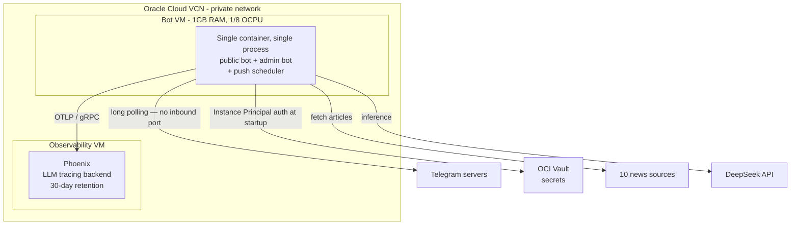
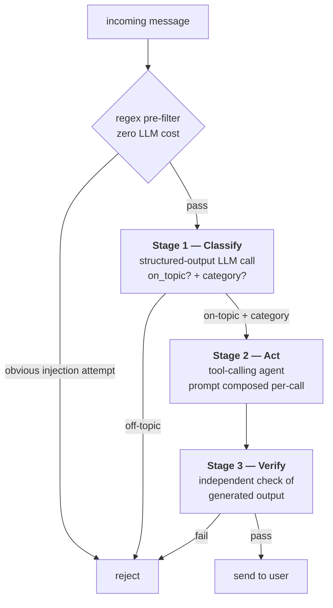
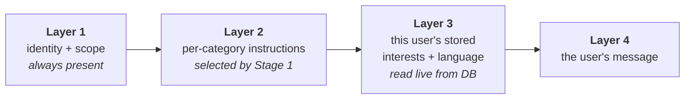
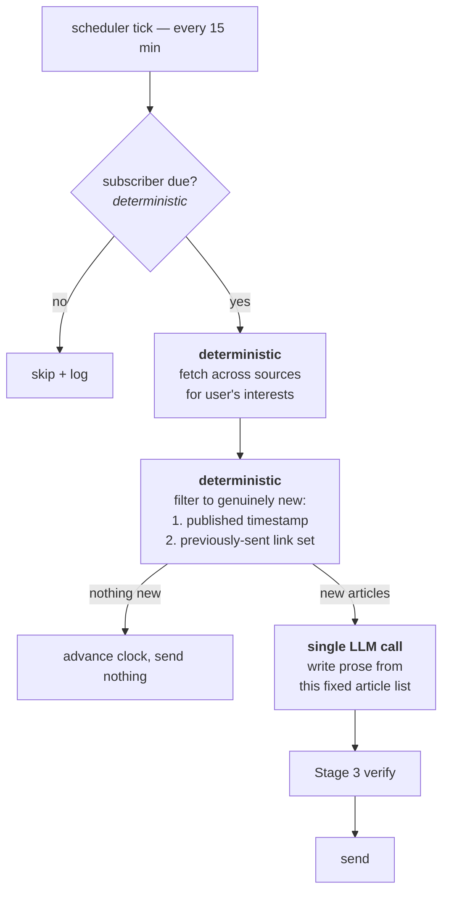

<!-- mdr-guide v="3"
Review notes are HTML comments whose body starts with "mdr". Apply each note to
the content it anchors, then delete its marker(s); never change unmarked content.
("»" = the comment close.)
• POINT — <!-- mdr id="ID" kind="K" … : NOTE »  → the element right before it.
• PAIR  — <!-- mdr-start id="ID" kind="text" : NOTE » …text… <!-- mdr-end id="ID" »  → the wrapped text.
kind: text=prose; code=preceding fenced block (span="sr:sc-er:ec" 0-based, quote="code"); diagram=preceding mermaid/plantuml.
mermaid-element=preceding mermaid fence, one node/edge (ref=native id; span/quote point to the
fence-internal line(s), 0-based fence-relative): edit those fence line(s) per NOTE.
svg-element=block referencing a local .svg (src=relative path; ref=element id; nth=fallback index):
target lives in the EXTERNAL file named by src, not here — edit that file, or report to a human.
frontmatter=the leading YAML block, anchored by key= (a top-level key). Edit INSIDE the --- block;
the marker itself sits after it. No span= → the NOTE is about that whole key/value. With span="s-e"
(0-based chars within that key's VALUE) → it is about just quote= inside the value; revise only that.
Decode in NOTE: \| \< \> \n \r \\ → | < > ⏎ CR \
Remove POINT = its one comment; PAIR = both markers (keep the revised text). When no mdr markers remain, delete this guide.
-->

# Autonomous Technology-Trend Intelligence Agent

<!-- mdr id="c-phigwjza" kind="text": There should be a sub title like "Proactive customized new search and deliver service" -->
### Design, Build, and Operations

<!-- mdr id="c-8nitgjuw" kind="text": More like What is the doc about. -->

**An LLM agent that monitors 10 technology sources and delivers
personalized trend intelligence on Telegram. Live in production on a cloud
VM, <!-- mdr-start id="c-d2mhg3aj" kind="text": No one care 0 cost. Can removed -->running at $0 infrastructure cost.<!-- mdr-end id="c-d2mhg3aj" -->**

Small in scope by design; complete in lifecycle — architecture, security,
deployment, observability, testing, and live incident response are all
built and in use. This document explains the engineering decisions, the
constraints that forced them, and the measurements that justified them.

<!-- mdr id="c-xdisxejc" kind="text": Brifily talk about what this document is talking about -->

---

## Why I built it

<!-- mdr id="c-c95wn8pq" kind="text": MAy be add two image to tell what is the results?\n\n<local-key-directory>\\t1.jpg and t2.jpg -->

I follow several areas of technology closely, but keeping current meant
working through a dozen sites and forums on a regular basis — Hacker News,
arXiv, company engineering blogs, the tech press. Most of what I read was
either duplicated across all of them or irrelevant to what I actually
cared about. The reading wasn't the expensive part; the **filtering** was.

What I wanted was an assistant that would make that pass for me: read
across the major sources, work out what's genuinely new, summarize the
*trends* rather than the individual headlines, and deliver the result to
me rather than waiting for me to go ask.

That original motivation directly shaped three decisions that recur
throughout this document:

- **<!-- mdr-start id="c-4rhd4tfd" kind="text": Move to last. Personalized and Push should be higher priority -->Synthesis, not aggregation<!-- mdr-end id="c-4rhd4tfd" -->** — merging coverage of the same story
  across sources is the entire point. A list of headlines is the problem
  I had, not the solution (§1)
- **Personalization** — "relevant to me" is inherently per-person, so
  interests are stored per user and steer every general query (§3)
- **Push, not pull** — the assistant comes to me. This is why the
  scheduled digest is a core feature rather than a nice-to-have, and why
  a messaging channel that couldn't support it was ultimately declined
  (§11)

---

## At a glance


| | |
|---|---|
| **<!-- mdr-start id="c-uddfy9a8" kind="text": Remove the current table from What to documented incident history. Redunt information with later detail -->What<!-- mdr-end id="c-uddfy9a8" -->** | Telegram bot delivering synthesized tech-industry news + trend reports, personalized per user |
| **Status** | Live in production, serving real users |
| **Scale** | Deliberately small — 1 GB RAM VM, zero infrastructure cost |
| **Tests** | 160 tests, ~2.5 s, $0 API cost per run |
| **Ops** | Managed-vault secrets, distributed tracing, 13-case post-deploy checklist, documented incident history |

### Stack, and why

<!-- mdr id="c-qzszcfvz" kind="text": More like overall component we choose? -->

Each choice below was a decision, not a default:

| Choice | Why this over the obvious alternative |
|---|---|
| **DeepSeek** | Roughly an order of magnitude cheaper than frontier models for a workload that's mostly summarization. Quality is sufficient for synthesis; the cost difference is what makes an always-on push feature viable at all. |
| **LangChain** | Framework-managed agent loop, and — critically — a swappable model interface. That's what allows the entire test suite to run against a scripted fake with no network and no API cost. |
| **Telegram** | Supports *long polling*, so the bot needs no public endpoint, no TLS, no domain. Eliminates an entire class of attack surface and ops burden. (LINE, evaluated later, is webhook-only — see §11.) |
| **SQLite** | Zero cost, zero operational overhead, adequate for current scale. A known limitation, deliberately accepted and scheduled for revisit — see §10. |
| **Oracle Cloud Always Free** | A genuinely perpetual free tier, not time-limited trial credits. Two VMs and a managed secrets vault at $0/month indefinitely. |
| **Arize Phoenix** | Self-hostable OpenTelemetry-native LLM tracing — full trace fidelity with no per-trace SaaS billing, which matters when tracing every call. |

---

## What this project demonstrates

<!-- mdr id="c-guaanan7" kind="text": Move to appendix: How leverage AI to this project? -->

<!-- mdr-start id="c-zim545xc" kind="text": This document covered...\n\nNo need to mention side project, and other project. And it seems can move to up before why I build it? -->Most side projects stop at *built*. This one covers the full loop:<!-- mdr-end id="c-zim545xc" -->
**design → secure → deploy → observe → operate → measure → decline the
wrong work.** It is a small service, but nothing in that loop is missing
or simulated — it's deployed, it has real users, and it has been debugged
in production from recorded evidence.

### How it was built — human + AI, deliberately


I built this working with an AI coding assistant throughout. That was a
deliberate choice, and I'd argue it's one of the things the project
demonstrates rather than a caveat on it.

The division of labour stayed consistent throughout:

| I owned | The AI assistant owned |
|---|---|
| **Problem definition** — <!-- mdr-start id="c-y55f95ma" kind="text": Define the scope, the feature, and the results -->what to build and why<!-- mdr-end id="c-y55f95ma" --> (see *Why I built it* above) | — |
| **<!-- mdr-start id="c-6n75vwqg" kind="text": Decide the cloud archetecture, the service infrastructure (docker + phoenix), the CI/CD workflow, incident detected and how to receive the incident -->Architecture decisions<!-- mdr-end id="c-6n75vwqg" -->** — including the layered-prompt structure (§3) and the choice to merge the safety gate and intent router into one call, both of which I specified before implementation | Turning those designs into working code |
| **Scope and priorities** — security before deployment; personalization before scale; decline the second channel (§11); accept SQLite's limits rather than migrate prematurely (§10) | Research passes I directed — LINE's pricing tiers, registrar comparison, library capabilities — which I then decided on |
| **<!-- mdr-start id="c-qhc59e8f" kind="text": Mode like guide what test need to be done, and what need to be coverage. Review the test plan and point out the gaps. ALSO manual test (manual test is the not import part. the high light part is to guide the direction and review the plan)\n\nAlso settle down the process when to test: CI, post Deployed -->QA from real use<!-- mdr-end id="c-qhc59e8f" -->** — I ran the live service as its actual user. The Markdown-rendering bug, the duplicate-interest bug, the broken onboarding in §9, and the push-timing question all surfaced because I noticed them in production, not because a test failed | Diagnostic execution — querying traces, running the N-trial measurements in §6, isolating root causes once pointed at a symptom |
| **Verification standards** — insisting a fix be measured before shipping, not assumed (§6), and that invariants be enforced in code rather than by prompt (§5) | Implementation, test authoring, documentation drafting |
| **Final judgment** — every decision recorded in this document is one I made and can defend | — |

The short version: **I was the engineer and the operator; the assistant
was leverage.** It wrote most of the lines; it did not decide what the
system should be, what was acceptable to ship, or when something was
actually fixed.

<!-- mdr id="c-4f5pkak2" kind="text": Removed -->

**What it changed:** the surface area here — cloud provisioning, secrets
management, an agent pipeline, guardrails, a scheduler, observability,
160 tests, and deployment tooling — would traditionally be a multi-week
solo effort, most of it spent on integration plumbing rather than design.
Working this way, it took **[TIMEFRAME — fill in]**, and the time went
into the parts that actually needed judgment: deciding where determinism
was required, measuring whether a guardrail actually worked, choosing
what not to build.

<!-- mdr id="c-vts2pxny" kind="text": Removed -->

The discipline matters more than the speed, though. Working effectively
this way means *not* trusting generated output by default — which is
exactly where §5 (enforce invariants in code, don't just ask nicely) and
§6 (measure the classifier, don't assume the plausible fix worked) come
from. Both of those sections are the direct product of verifying rather
than accepting.

<!-- mdr id="c-hbx47uys" kind="text": Remove and the table below -->

| What it shows | Where to look | Why it matters on a team |
|---|---|---|
| **LLM/agent architecture** | §3 — three-stage classify → act → verify pipeline; layered prompt composition | Can design a system, not just call an API |
| **Knowing when *not* to use an LLM** | §4 — push dedup is guaranteed by construction, not by prompting | Won't reach for the fashionable tool where boring code is correct |
| **Engineering around probabilistic components** | §5 — code-level enforcement of invariants prompts can only make *likely* | Ships LLM features that hold up in production, not just in a demo |
| **Empirical rigor** | §6 — a plausible "improvement" measured 1/15 and was rejected before shipping | Verifies instead of assuming; catches own mistakes before users do |
| **Designing under hard constraints** | §7 — two bots + scheduler in 1 GB, with the measurement behind the topology | Makes cost/resource tradeoffs deliberately and can defend them |
| **Security thinking** | §8 — zero stored credentials, layered injection defense | Security is designed in, not bolted on after review |
| **Production ownership** | §9 — CI, deploy workflow, tracing-based debugging, post-deploy checks | Can be handed a service and trusted to run it |
| **Honest self-assessment** | §10 — known failure modes, each with a trigger for when it must be fixed | Will tell you the real status, not the comfortable one |
| **Scope judgment** | §11 — features fully researched, then declined, reasoning recorded | Knows when to stop; won't gold-plate a pilot |

---

## 1. <!-- mdr-start id="c-7n628huy" kind="text": Re structure this chapter\nA. Architecture\n1. Overall architecture (include CI, CD)\n2. The Main server and the Manage server (Phoenix)\n3. MSI and KV security\n4. SSH tuanl for management \n\nB System Design\n1. component overview (agent, bot, admin, guardrail, source and telemetry)\n2. Agent design (flow chat, why mutiple LLM call, how the workflow looks like)\n3. How the 4 layer prompts was for\n4. How we prevent the dangerous message \n\n\nC. Quality insure\n1. Test case\n2. Test before commit (CI)\n3. Post deployment test (integrate test)\n4. Monitoring (no logs)\n5. incident reporting\n\n4. -->What it does<!-- mdr-end id="c-7n628huy" -->

Aggregates across **10 news sources** (Hacker News, arXiv, company
engineering blogs, tech press, plus optional paid APIs) and uses an LLM to
*synthesize* — spotting themes across sources and merging coverage of the
same story — rather than dumping headlines.

| Capability | Detail |
|---|---|
| On-demand trend reports | Ask about a company, product, or trend; get a synthesized report citing real source URLs |
| Personalized interests | Stored per user; prioritized on general questions |
| Reply language | Set once, applies to *everything* after — including script variants (Traditional vs. Simplified Chinese) |
| Scheduled push digests | Per-user interval, deduplicated against what that user has already been sent |
| Access control | Admin-approval workflow; not an open service |

Every capability is controllable **two ways** — a slash command or plain
natural language ("add robotics to my interests", "start pushing me news
every 6 hours"). Natural language isn't decoration: voice input is a
planned direction, and voice has no slash commands.

The source registry degrades gracefully by design — a source that errors
or lacks an API key is skipped, and the request still succeeds on the
rest. One broken upstream never fails a user request.

---

## 2. The constraints that shaped everything

Four constraints drove nearly every decision that follows.

**C1 — Zero infrastructure budget.** Everything runs on Oracle Cloud's
Always Free tier. The application VM is a `VM.Standard.E2.1.Micro`:
**1 GB RAM, 1/8 OCPU**. That is not much headroom for a Python process
loading LangChain.

**C2 — The LLM is non-deterministic and cannot be unit tested.** There is
no assertion for "the model follows this instruction." It mostly will.
Occasionally it won't. Any behavior that *must* hold cannot be enforced by
a prompt alone.

**C3 — Input comes from strangers.** Anyone can find and message the bot.
That is both a prompt-injection surface and a cost-abuse surface.

**C4 — One operator, no on-call rotation.** Every failure has to be
diagnosable after the fact, from evidence the system recorded on its own.

### Architecture

Two VMs on a private virtual cloud network. Observability is isolated from
the application — from the public internet, and from application compute
contention.



**Note the direction of the Telegram arrow.** The bot polls outbound;
there is no inbound port, no TLS termination, no public endpoint. That was
deliberate — it eliminates an entire class of attack surface and
operational burden at no cost. It's also why adding a second messaging
channel turned out to be expensive (§11).

---

## 3. A three-stage pipeline that serves every request type

Every message goes through the same pipeline, regardless of what the user
is asking for.



**Stage 1 does two jobs in one call.** It answers both "is this in scope?"
(a safety gate) and "what kind of request is this?" (a router). The
obvious implementation is two separate LLM calls — one guardrail, one
intent classifier. Merging them halves the latency and cost of the gate on
*every* message, and both questions need the same understanding of the
input anyway.

**Stage 2's system prompt is composed fresh on every call**, from four
layers:



This is the mechanism behind every personalization feature. There is no
per-user branching in application code and no per-user agent instance —
one code path serves everyone, and the difference is entirely what gets
composed into the prompt. Layer 2 also scopes which *tools* are relevant
for that turn, so a "change my language" request doesn't carry
news-formatting instructions.

Layers don't accumulate — they're rebuilt per call, so system prompt size
is constant regardless of conversation length. Only conversation history
grows, and that's separately capped (§7).

**Stage 3 inspects what the model actually wrote**, not what the user
asked. Some failure modes are only visible in the output. The check is
deliberately **narrower for constrained request types**: for "add an
interest", Stages 1–2 already pin down what a valid reply looks like, so
Stage 3 only checks for self-disclosure. Open-ended news queries, where
the model has real latitude, get the full check.

---

## 4. Knowing when *not* to use the LLM

This is the design decision I'd most want a reviewer to look at.

The scheduled push feature sends a periodic digest of *new* articles. The
obvious implementation reuses the agent that already works: put it on a
timer and let it call the search tool.

**That design cannot satisfy the requirement.** The requirement is "never
send the same article twice." An agent choosing its own search calls will
re-fetch the same top-N-by-recency results and re-report them. You would
be *hoping* the model notices repetition — and per C2, hope is not a
mechanism.

So the push path inverts the usual agent structure:



**The LLM is used only for what it's uniquely good at — writing readable
prose.** Selection, deduplication, and scheduling are ordinary
deterministic code. Repeats become impossible by construction rather than
unlikely by persuasion.

Deduplication is belt-and-braces: primarily by publication timestamp (skip
anything published at or before that user's last push), with a remembered
set of recently-sent URLs as fallback for sources whose date strings don't
parse. Both are necessary — real-world feeds are inconsistent about dates.

*A related find:* the on-demand path had a subtler version of the same
problem. Every source fetcher parsed a publication date, but the tool that
formatted results for the model **dropped it** before the model saw it.
The model had no way to judge recency or notice it was repeating itself.
Fixing the data plumbing mattered far more than any prompt tuning would
have.

---

## 5. Prompt instructions are optimizations; invariants need code

Constraint C2 in practice.

**Telegram renders HTML, not Markdown.** The prompt says so explicitly.
The model complies — most of the time. When it doesn't, users see literal
`**asterisks**`. Prompt tuning improved this and did not eliminate it.

**The fix is a regex, not a better prompt:**

```python
_MARKDOWN_BOLD_RE = re.compile(r"\*\*(.+?)\*\*")

def _normalize_markdown_bold(text: str) -> str:
    """No-op when the model behaves. A fix when it doesn't."""
    return _MARKDOWN_BOLD_RE.sub(r"<b>\1</b>", text)
```

Same pattern elsewhere: the model was told to start replies directly with
the report, and mostly did — occasionally it narrated its process first
("Let me compile these into a report..."). A deterministic strip of
everything before the report's marker handles it.

**The generalized principle:**

> A prompt instruction is an *optimization* — it makes the good outcome
> likely. For any invariant that must hold on user-visible output, there
> must also be code-level enforcement. Keep both: the prompt makes the
> backstop rarely fire; the backstop makes the guarantee real.

Defense-in-depth applied to a probabilistic component. It's the most
transferable idea in this project.

---

## 6. Measuring model reliability instead of reasoning about it

Because C2 rules out unit-testing model behavior, the alternative is
**N-trial measurement against the real model before shipping a prompt
change.** That discipline caught something genuinely counterintuitive.

The Stage 3 output check was doing two things: detecting self-disclosure
(the bot revealing its own configuration) and judging topical
appropriateness. It had a false-positive problem. The obvious fix was to
split the harder check into its own smaller, focused prompt — a narrower
question should be more reliable.

**Measured, it was dramatically worse.** The isolated prompt caught real
self-disclosure **1 time out of 15**. The surrounding structure of the
original prompt had been doing load-bearing work that was invisible from
reading it.

What actually worked was changing the *output format*, not the wording:
replacing a staged yes/no text answer with **structured output containing
two independent boolean fields**. Measured across the same cases plus
regressions: **60/60**.

| Approach | Self-disclosure detection | False-positive case |
|---|---|---|
| Original combined text prompt | unreliable | 1/3 |
| Reworded text prompt | — | 13/15 |
| Isolated narrow text prompt | **1/15** ❌ | — |
| **Structured output, two booleans** | **✅** | **15/15** |

Two takeaways: structured output is meaningfully more reliable than asking
a model for a parseable text answer — and **the "obvious" prompt
improvement must be measured, because intuition about prompt behavior is
unreliable.** Shipping that plausible-sounding simplification unmeasured
would have quietly broken a safety control.

---

## 7. <!-- mdr-start id="c-2qnaz3di" kind="text": Diffuclity we hit (not specific 1 GB, and put all the issue, and how we solve it iin this chapter) -->Working within 1 GB<!-- mdr-end id="c-2qnaz3di" -->

C1, concretely.

**Two bots, one process.** The system runs two distinct Telegram bot
identities — a public one anyone can message, and an admin one that
receives approval requests with inline Approve/Deny buttons. Keeping them
as separate identities is a security property: a stranger who finds the
public bot has no path to the approval controls.

But running them as two OS processes means loading LangChain and
`python-telegram-bot` into memory **twice**. Measured: **~135 MB as a
single combined process, versus close to double that split.** On a 1 GB
box, that's the difference between comfortable and fragile.

So they share one process and one asyncio event loop while remaining two
separate bot identities. **The security boundary is preserved; the memory
cost isn't paid twice.** Steady-state usage runs 137–172 MB.

The tradeoff is honest: separate processes would give better fault
isolation. On a larger instance that would be the better call, and the
code is structured so either topology works — each bot retains a
standalone entry point.

**Context-window management.** Conversation history is capped at **1 hour
and 20 messages**, whichever binds first — aggressive on purpose. This
bot's answers are essentially stateless per topic (a news summary from an
hour ago has little bearing on a new question), so carrying context has
little value, while unbounded history means unbounded cost and eventual
context-window failure on a long-running process.

---

## 8. Security

**Zero stored credentials.** Every secret — LLM API key, both bot tokens,
telemetry key — lives in OCI Vault and is fetched at container startup via
**Instance Principal authentication**. The VM proves its own identity to
OCI; there is no bootstrap credential to leak. Nothing is baked into the
image, committed to source control, or passed as a plaintext environment
variable. What *is* passed to the container are secret **OCIDs** —
resource identifiers, useless without the VM's own identity.

**Approval-gated access (C3).** Every new user lands in a pending state;
the admin approves or denies from the second bot. This bounds cost-abuse
exposure to a known set of users.

**Layered prompt-injection defense.** Four layers, cheapest first: a regex
pre-filter that costs nothing, the Stage 1 scope gate, hardened system
prompt instructions, and the Stage 3 output check. The ordering is
deliberate — obvious attacks are rejected before they cost an LLM call.

**Two independent network layers.** Cloud security groups *and* host-level
firewall rules must both permit traffic. Either one misconfigured fails
closed, not open.

---

## 9. Production ownership

**Testing.** 160 tests, **~2.5 seconds, $0 in API cost.** That's possible
because the model is dependency-injected: production passes a real
`ChatDeepSeek`, tests pass a scripted fake. No conditional logic, no
network, no flakiness from a live model — cheap enough to run on every
change rather than before a release.

What unit tests structurally *cannot* cover is anything requiring a real
model. That's covered separately:

**Post-deploy verification.** A checklist of **13 real input/expected-output
cases**, run against the live system after every deployment — HTML
rendering, non-English input, script-variant handling, guardrail behavior,
new-user onboarding. Each case was derived from a real regression class,
so the checklist grows as the system teaches me what breaks.

**Deployment.** Images are always built locally and transferred to the VM,
never built on it — C1 again; a build's resource spike doesn't fit
comfortably on the instance. Automated CD is designed but not yet built: a
GitHub Actions **self-hosted runner** on a machine I already control, so
no deployment credential ever needs to live in GitHub's secret store —
the same principle as the Vault design.

**Observability as a debugging instrument (C4).** Every LLM call and tool
invocation is captured as a structured trace with its exact prompt and
response, queryable after the fact via GraphQL. This isn't a dashboard
that gets glanced at — it's the primary tool for root-causing production
behavior that can't be reproduced locally, precisely *because* the model
is non-deterministic. Retention is explicitly bounded at 30 days; the
default was unbounded growth.

Incidents are root-caused from recorded evidence rather than speculation,
and each one feeds back into either the test suite or the post-deploy
checklist so the same class of failure is caught automatically next time.

### A worked example: silent onboarding failure

Worth showing rather than claiming, because the failure was completely
silent — no error, no exception, nothing in any log.

**Symptom.** I invited someone to the bot. They messaged it. They never
appeared in the approval queue, and never got a reply.

**Evidence gathered, before forming a theory:**

| Check | Result | What it ruled out |
|---|---|---|
| Query the live subscribers table | No pending row for them at all | The approval flow didn't partially run — `request_access()` was never called |
| Full container logs | Completely clean; zero errors | Not a crash, not an exception being swallowed |
| Both bot identities via Telegram's API | Both alive, correct usernames | Not a token/config problem, not a wrong-bot mixup |

Three checks eliminated the likely causes and left something
uncomfortable: the message appeared not to have been *processed at all*.

**The clue** came from asking them for a screenshot: their first message
was `/start` — which is what Telegram's own client sends when a user taps
the START button on a bot they've never used.

**Root cause.** The bot registered command handlers for `/interests` and
`/language`, and a plain-text handler filtered with `~filters.COMMAND` —
which excludes *every* command. There was no `/start` handler. So `/start`
matched no handler at all: no reply, no database write, no exception. It
failed into a gap in the routing table.

**Impact was worse than one user.** `/start` is the literal first thing
Telegram prompts a new user to send. Onboarding was broken for *every*
new user — invisibly, because a message matching nothing produces no error.

**Fix, and the part that matters.** Adding the handler was trivial. The
useful question was why nothing caught it. The existing test asserted:

```python
assert any(isinstance(h, MessageHandler) for h in handlers)
```

That passed the entire time the bug existed — a `MessageHandler` *was*
registered, just not one that could ever match `/start`. The test was
checking that routing existed, not that it was *correct*. So the fix
included tightening it to assert the exact command set:

```python
commands = {next(iter(h.commands)) for h in handlers
            if isinstance(h, CommandHandler)}
assert commands == {"start", "interests", "language"}
```

Now a missing command fails loudly in CI. A new post-deploy case — "send
`/start` from an account with no history" — was added too, since this
class of bug only manifests against a genuinely new user.

**The transferable lesson:** a test that asserts a *category* of thing
exists will happily pass while the specific thing is broken. And silent
failures are worth over-investigating — a bug that produces no error
signal will not surface on its own, no matter how long it runs.

---

## 10.<!-- mdr-start id="c-rj6tjnfg" kind="text": Can merge with above about the diffuclty and issue and how we solve it --> Known limitations and failure modes<!-- mdr-end id="c-rj6tjnfg" -->

What this system *cannot* currently do, stated plainly. Most of these are
accepted tradeoffs rather than oversights, but they are real.

| Limitation | Impact | Current mitigation | Fix when |
|---|---|---|---|
| **Single point of failure** — one VM, one SQLite file, no replication or backup | VM loss = service down *and* all subscriber data lost | Container auto-restarts on crash; data is reconstructible (users can re-subscribe) | Before real users. Backup is cheap; it's scheduled, not done |
| **Guardrail classifiers are probabilistic** | A legitimate message can occasionally be rejected; a bad one can occasionally pass | Four independent layers, so a single-layer miss isn't a full bypass; classifiers fail *open* on error so an outage never blocks legitimate use | Inherent to the approach. Reduced by measurement (§6), not eliminated |
| **Conversation history is in-memory** | Restart loses in-flight context | Deliberate — context is capped at 1 h / 20 messages anyway, so the loss is small by construction | Only if conversations become genuinely multi-turn |
| **No rate limiting** | An approved user could burn API quota, accidentally or deliberately | Access is approval-gated, bounding exposure to known users | Before opening access more widely |
| **SQLite can't be shared or scaled** | Hard ceiling on horizontal scaling; both bots must run on one host | Fine at current scale; the single-process topology (§7) means there's no second host needing access today | When a second host or real concurrency is needed |
| **Cost scales linearly with users** | Each push subscriber costs LLM calls on every interval; no budget cap enforced | Cheap model choice; conservative interval floor (1 h minimum) | Before any open signup |
| **Deployment has a manual step** | Human error surface on every release | Documented deploy workflow + a 13-case post-deploy checklist that catches a bad deploy quickly | CD is designed (§9), not yet built |
| **Silent degradation of news sources** | If an upstream changes format, that source quietly returns nothing | Per-source error isolation means the request still succeeds on remaining sources — but nothing currently *alerts* on a source going quiet | Needs a source-health check; not built |

The pattern worth noting: most of these are consequences of C1 (zero
budget) and the pilot stage, and each has an explicit trigger condition
for when it stops being acceptable. None of them are unknown.

---

## 11. <!-- mdr-start id="c-hnb34gxx" kind="text": Same as above -->Deliberately not built<!-- mdr-end id="c-hnb34gxx" -->

Judgment shows as much in what's declined as in what ships.

**A second messaging channel (LINE).** Fully designed, then shelved after
research. LINE's Messaging API is webhook-only, which would have forced a
public HTTPS endpoint, TLS certificate management, a domain, and webhook
signature verification — dismantling the "no inbound port" property in §2.
That cost might have been justified, except the free tier caps **push
messages at 200/month account-wide** (replies are unlimited). The push
digest is the feature that makes the product worth having, and 200/month
across all users doesn't support it. Decision: hold until there's a
business model that justifies the paid tier. The research is written up
rather than discarded.

**A managed database.** SQLite on one VM doesn't scale and can't be
shared — a real limitation, and an understood one. But this is a pilot
with no paying users, and migrating now would mean paying migration cost
twice: once today, once again when the actual requirements are known.
Deliberately accepting a bounded risk instead of prematurely committing.

**Rate limiting, database backups, dependency scanning.** All identified
in a written security review, all documented, none built. They're scoped
as "before real users", not "before a pilot works."

---

## Summary

The system is a personalized news agent. The engineering content is mostly
about **working with a probabilistic component under hard resource
limits**:

- Use the LLM where it's uniquely strong (synthesis, prose) and ordinary
  deterministic code everywhere correctness matters — §4
- Treat prompt instructions as optimizations; enforce invariants in
  code — §5
- Measure model reliability empirically, because intuition about prompts
  is unreliable — §6
- Let constraints drive architecture, and state the tradeoffs honestly
  rather than pretending they don't exist — §7

Scope is small on purpose. Completeness is not: design, security,
deployment, observability, testing, and incident response are all real and
all in use.
