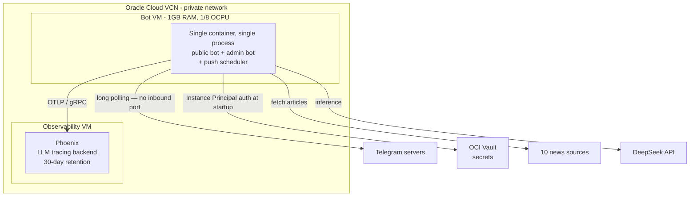
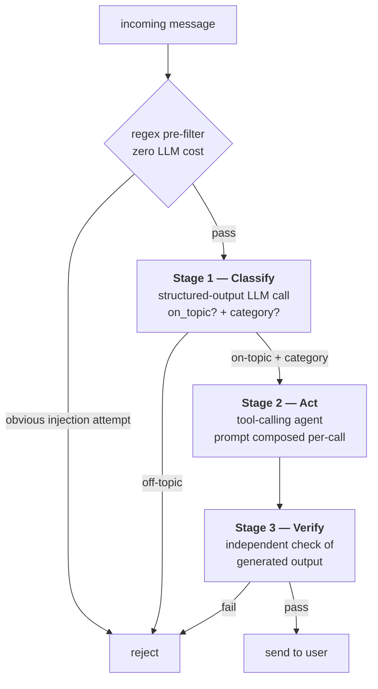
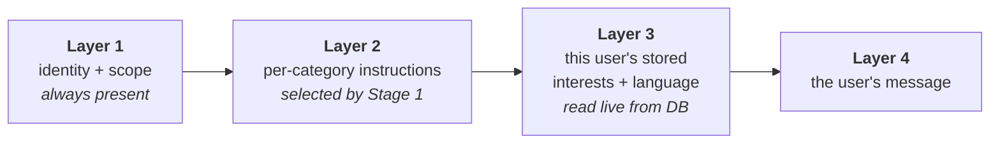
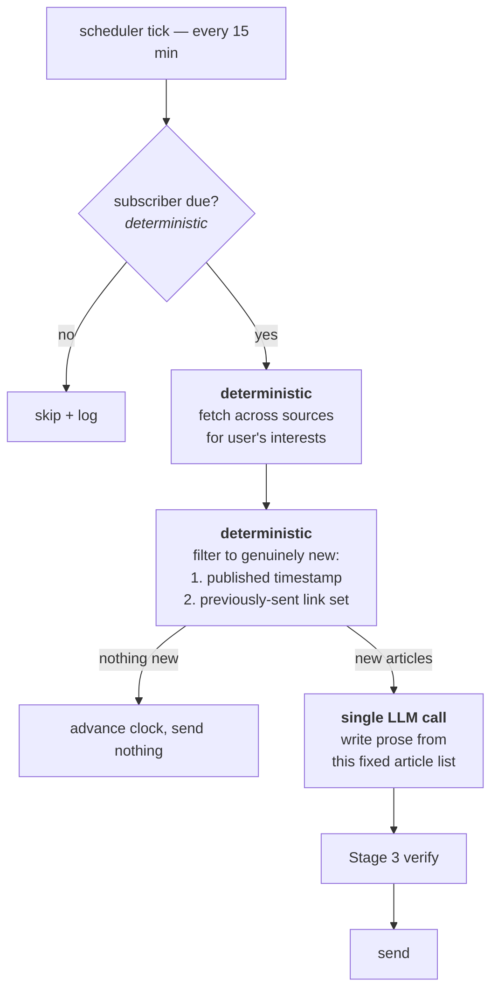

# Building a Personalized News Agent Under Hard Constraints

A technical walkthrough of an LLM-powered Telegram news agent — written for
engineers. The interesting part isn't the feature list; it's what the
constraints forced. This document is organized around the decisions, the
alternatives rejected, and the numbers that justified them.

> For real production incidents and prepared answers to hard questions,
> see the separate `docs/engineering-faq.md` (internal).

---

## 1. What it does

A Telegram bot that delivers personalized technology-industry news and
trend analysis. It aggregates across 10 sources (Hacker News, arXiv,
company engineering blogs, tech press, plus optional paid APIs), then uses
an LLM to *synthesize* — spotting themes across sources and merging
coverage of the same story — rather than dumping headlines.

| Capability | Detail |
|---|---|
| On-demand trend reports | Ask about a company, product, or trend; get a synthesized report citing real source URLs |
| Personalized interests | Stored per user; prioritized on general questions |
| Reply language | Set once, applies to *everything* afterward — including script variants (Traditional vs. Simplified Chinese) |
| Scheduled push digests | Per-user interval, deduplicated against what you've already been sent |
| Access control | Admin-approval workflow; not an open service |

Every capability is controllable **two ways** — a slash command or plain
natural language ("add robotics to my interests", "start pushing me news
every 6 hours"). Natural language isn't a gimmick: voice input is a
planned direction, and voice has no slash commands.

---

## 2. The constraints that shaped everything

Four constraints drove nearly every design decision in this system. They're
worth stating up front, because most of what follows only makes sense in
light of them.

**C1 — Zero infrastructure budget.** Everything runs on Oracle Cloud's
Always Free tier. The application VM is a `VM.Standard.E2.1.Micro`:
**1 GB RAM, 1/8 OCPU**. That is not a lot of headroom for a Python process
loading LangChain.

**C2 — The LLM is non-deterministic and cannot be unit tested.** You
cannot write an assertion for "the model follows this instruction." It
mostly will. Occasionally it won't. Any behavior that *must* hold cannot
be enforced by a prompt alone.

**C3 — Input comes from strangers.** It's a bot anyone can find and
message. That's a prompt-injection surface and a cost-abuse surface.

**C4 — One operator, no on-call.** Every failure has to be diagnosable
after the fact, from evidence the system recorded on its own.

---

## 3. Architecture

Two VMs on a private virtual cloud network. The observability backend is
deliberately isolated from the application — both from the public internet
and from application compute contention.



**Note the direction of the Telegram arrow.** The bot polls outbound; there
is no inbound port, no TLS termination, no public endpoint. This was a
deliberate choice — it eliminates an entire class of attack surface and
operational burden for free. (It's also why adding LINE turned out to be
expensive; see §8.)

Core components:

| Component | Role |
|---|---|
| Agent core | LangChain `create_agent` + DeepSeek in a tool-calling loop |
| Channel adapter | `python-telegram-bot`, polling mode |
| Data layer | SQLite — approval status, interests, language, push config |
| Source registry | 10 pluggable fetchers; 7 keyless, 3 gated behind optional API keys |
| Observability | Arize Phoenix (OpenTelemetry) |

The source registry degrades gracefully by design: a source that errors or
lacks an API key is skipped, and the request still succeeds with whatever
the other sources returned. One broken upstream never fails a user request.

---

## 4. Decision: one classifier call that does two jobs

Every message goes through the same three-stage pipeline, regardless of
what the user is asking for.



**The design decision:** Stage 1 is a single structured-output call that
answers *two* questions at once — "is this in scope?" (a safety gate) and
"what kind of request is this?" (a router). The obvious implementation is
two separate LLM calls: one guardrail, one intent classifier. Merging them
halves the latency and cost of the gate on every single message, and they
need essentially the same understanding of the message anyway.

Stage 2's system prompt is **not static** — it's composed fresh on every
call from four layers:



This is the mechanism behind every personalization feature. There is no
per-user branching in application code and no per-user agent instance —
one code path serves everyone, and the difference is entirely what gets
composed into the prompt. Layer 2 also determines which *tools* are
relevant for that turn, so a "change my language" request isn't carrying
instructions about news-report formatting.

**Layers don't accumulate.** They're rebuilt from scratch per call, so the
system prompt has a fixed size regardless of conversation length. Only
conversation history grows — and that's separately capped (§7).

Stage 3 inspects what the model *actually wrote*, not what the user asked.
Some failure modes are only visible in the output. The check is
deliberately **narrower for constrained request types**: for "add an
interest", Stages 1–2 already pin down what a valid reply looks like, so
Stage 3 only checks for self-disclosure. For open-ended news queries,
where the model has real latitude, it checks more.

---

## 5. Decision: keep the LLM out of the loop where determinism is required

This is the design I'd most want a reviewer to look at.

The scheduled push feature sends a periodic digest of *new* articles. The
obvious implementation reuses the agent that already works: put it on a
timer and let it call `search_news`.

**That design cannot satisfy the requirement.** The requirement is "don't
send the user the same article twice." An agent deciding its own search
calls will re-fetch the same top-N-by-recency results and re-report them.
You'd be *hoping* the model notices repetition — and per C2, hope is not a
mechanism.

So the push path inverts the usual agent structure:



**The LLM is used only for the one thing it's uniquely good at — writing
readable prose.** Selection, deduplication, and scheduling are ordinary
deterministic code. Repeats are now impossible by construction rather than
unlikely by persuasion.

Dedup is belt-and-braces: primarily by publication timestamp (skip anything
published at or before the user's last push), with a remembered set of
recently-sent URLs as a fallback for sources whose date strings don't
parse. Both are needed — real-world feeds are inconsistent about dates.

*Related finding:* the on-demand path had a subtle version of the same
problem. Every source fetcher parsed a publication date, but the tool that
formatted results for the model **dropped it** before the model ever saw
it. The model had no way to judge recency or notice it was repeating
itself. Fixing the data plumbing mattered more than any prompt tuning
would have.

---

## 6. Decision: treat prompt compliance as best-effort, back it with code

Constraint C2 in practice. Two examples, both real:

**Telegram renders HTML, not Markdown.** The prompt says so explicitly.
The model complies — most of the time. When it doesn't, users see literal
`**asterisks**`. Prompt tuning improved this and did not eliminate it.

**The fix is a regex, not a better prompt:**

```python
_MARKDOWN_BOLD_RE = re.compile(r"\*\*(.+?)\*\*")

def _normalize_markdown_bold(text: str) -> str:
    """No-op when the model behaves. A fix when it doesn't."""
    return _MARKDOWN_BOLD_RE.sub(r"<b>\1</b>", text)
```

Same pattern for report preambles: the model was told to start directly
with the report, and mostly did — occasionally it narrated its process
first ("Let me compile these into a report..."). A deterministic strip of
everything before the report's marker character handles it.

**The generalized principle:**

> A prompt instruction is an *optimization* — it makes the good outcome
> likely. For any invariant that must hold on user-visible output, there
> must also be a code-level enforcement. Keep both: the prompt makes the
> backstop rarely fire; the backstop makes the guarantee real.

This is defense-in-depth applied to a probabilistic component, and it's the
single most transferable idea in this project.

---

## 7. Decision: measure LLM reliability rather than reasoning about it

Because C2 means you can't unit test model behavior, the alternative is
**N-trial measurement against the real model before shipping a prompt
change.** This caught something genuinely counterintuitive.

The Stage 3 output check was doing two things: detecting self-disclosure
(the bot revealing its own configuration) and judging topical
appropriateness. It had a false-positive problem. The obvious fix was to
split the harder check into its own smaller, more focused prompt — a
narrower question should be more reliable.

**Measured, it was dramatically worse.** The isolated prompt caught real
self-disclosure **1 out of 15 times**. The surrounding structure of the
original prompt had been doing load-bearing work that wasn't visible from
reading it.

What actually worked was changing the *output format*, not the wording:
replacing a staged yes/no text answer with **structured output containing
two independent boolean fields**. Measured across the same cases plus
regression cases: **60/60**.

| Approach | Self-disclosure detection | False-positive case |
|---|---|---|
| Original combined text prompt | unreliable | 1/3 |
| Reworded text prompt | — | 13/15 |
| Isolated narrow text prompt | **1/15** ❌ | — |
| **Structured output, two booleans** | **✅** | **15/15** |

Two takeaways: structured output is meaningfully more reliable than
asking a model to produce a parseable text answer, and **the "obvious"
prompt improvement has to be measured, because intuition about prompt
behavior is unreliable.** Shipping that plausible-sounding simplification
unmeasured would have quietly broken a safety control.

---

## 8. Working within 1 GB

C1, concretely.

**Two bots, one process.** The system runs two distinct Telegram bot
identities — a public one anyone can message, and an admin one that
receives approval requests with inline Approve/Deny buttons. Keeping them
as separate identities is a security property: a stranger who finds the
public bot has no path to the approval controls.

But running them as two OS processes means loading LangChain and
`python-telegram-bot` into memory **twice**. Measured: ~135 MB as a single
combined process, versus close to double that split. On a 1 GB box, that's
the difference between comfortable and fragile.

So they share one process and one asyncio event loop, while remaining two
separate bot identities. **The security boundary is preserved; the memory
cost isn't paid twice.** Steady-state usage runs 137–172 MB.

The tradeoff is honest: separate processes would give better fault
isolation. On a larger instance that would be the better call, and the code
is structured so either topology works — each bot retains a standalone
entry point.

**Context window management.** Conversation history is capped at **1 hour
and 20 messages**, whichever binds first. This is aggressive on purpose:
this bot's answers are essentially stateless per topic — a news summary
from an hour ago has little bearing on a new question — so there's little
value in carrying context, and unbounded history means unbounded cost and
eventual context-window failure on a long-lived process.

---

## 9. Security

**Zero stored credentials.** Every secret — LLM API key, both bot tokens,
telemetry key — lives in OCI Vault and is fetched at container startup via
**Instance Principal authentication**. The VM proves its own identity to
OCI; there is no bootstrap credential to leak. Nothing is baked into the
image, committed to source control, or passed as a plaintext environment
variable. What *is* passed to the container are secret **OCIDs** —
resource identifiers, useless without the VM's own identity.

**Approval-gated access (C3).** Every new user lands in a pending state.
The admin approves or denies from a second bot. This bounds cost-abuse
exposure to a known set of users.

**Layered prompt-injection defense.** Four layers, cheapest first: a regex
pre-filter that costs nothing, the Stage 1 scope gate, hardened system
prompt instructions, and the Stage 3 output check. The ordering is
deliberate — obvious attacks are rejected before they cost an LLM call.

**Two independent network layers.** Cloud security groups *and* host-level
firewall rules both have to permit traffic. Either one misconfigured fails
closed, not open.

---

## 10. Engineering practice

**Testing.** 160 tests, **~2.5 seconds, $0 in API cost.** This is possible
because the model is dependency-injected: production passes a real
`ChatDeepSeek`, tests pass a scripted fake. No conditional logic, no
network, no flakiness from a live model. Cheap enough to run on every
change rather than before a release.

What's *not* covered by unit tests is anything requiring a real model — so
that's covered differently:

**Post-deploy verification.** A defined checklist of real inputs and
expected outputs, run against the live system after every deployment.
Thirteen cases, each derived from a real regression class: HTML rendering,
non-English input, script-variant handling, guardrail behavior, new-user
onboarding. Unit tests against fakes structurally cannot catch these.

**Deploy workflow.** Images are always built locally and transferred to the
VM, never built on it — C1 again; a build's resource spike doesn't fit
comfortably on the instance, and a local build is faster and safer to
interrupt. Automated CD is designed but not yet built: a GitHub Actions
**self-hosted runner** on a machine the operator already controls, so no
deployment credential ever needs to live in GitHub's secret store. Same
principle as the Vault design — no standing credential leaves a device
already trusted.

**Observability as a debugging tool (C4).** Every LLM call and tool
invocation is captured as a structured trace with its exact prompt and
response, queryable after the fact via GraphQL. This is not a dashboard
that gets glanced at — it's the primary instrument for root-causing
production behavior that can't be reproduced locally, precisely because
the model is non-deterministic. Retention is explicitly bounded at 30 days;
the default was unbounded growth.

---

## 11. What was deliberately not built

Judgment shows as much in what's rejected as what ships.

**A second messaging channel (LINE).** Fully designed, then shelved after
research. LINE's Messaging API is webhook-only, which would have forced a
public HTTPS endpoint, TLS certificate management, a domain, and webhook
signature verification — dismantling the "no inbound port" property in §3.
That cost might have been justified, except the free tier caps **push
messages at 200/month account-wide** (replies are unlimited). The push
digest is the feature that makes the product worth having, and 200/month
across all users doesn't support it. Decision: hold until there's a
business model that justifies the paid tier. The research is written up
rather than discarded.

**A managed database.** SQLite on one VM doesn't scale and can't be shared.
That's a real limitation and it's understood. But this is a pilot with no
paying users, and migrating to a managed DB now would mean paying
migration cost twice — once now, once when actual requirements are known.
Explicitly accepting the risk of data loss in exchange for not
prematurely committing.

**Rate limiting, DB backups, dependency scanning.** All identified in a
security review, all documented, none built. They're correctly scoped as
"before real users", not "before a pilot works."

---

## Summary

The system is a personalized news agent, but the engineering content is
mostly about **working with a probabilistic component under hard resource
limits**:

- Use the LLM where it's uniquely good (synthesis, prose), and ordinary
  deterministic code everywhere correctness matters — §5.
- Treat prompt instructions as optimizations, and enforce invariants in
  code — §6.
- Measure model reliability empirically, because intuition about prompts
  is unreliable — §7.
- Let constraints drive architecture, and state the tradeoffs honestly
  rather than pretending they don't exist — §8.
